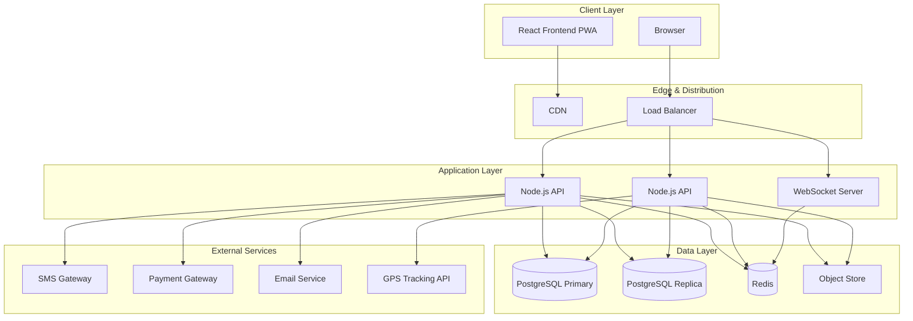

## 1. Introduction & Project Overview

Educational institutions manage vast structured data — admissions, attendance, examination results, fee ledgers, transport schedules, hostel records. Most schools under five thousand students still rely on paper registers or disconnected spreadsheets. The School Management System (SMS) consolidates these fragmented workflows into a unified platform built on **Node.js** backend and **React** frontend.

### 1.1 Purpose and Scope

#### 1.1.1 Problem Statement

Paper-based administration creates compounding inefficiencies. Physical student files resist search and archival. Attendance manually keyed into spreadsheets invites transcription errors. Fee ledgers lack automated reconciliation. Critical communications — exam schedules, fee reminders, absence alerts — arrive late or are lost. These delays inflate clerical workload and deny parents visibility into their child's progress.

#### 1.1.2 Scope Boundaries

The SMS covers eleven modules: **Student Management**, **Teacher/Staff Management**, **Academic Management**, **Attendance Management**, **Examination & Grading**, **Fee & Finance Management**, **Library Management**, **Transport Management**, **Hostel Management**, **Communication & Notifications**, and **Reporting & Analytics**.

Explicit exclusions: **LMS** features (video lectures, SCORM); **payroll tax filing** and government submission (payslip generation is included); **multi-tenant federation** for multi-branch chains.

#### 1.1.3 Target User Personas

| Persona | Responsibilities | System Interaction |
|---|---|---|
| **School Administrator** | System config, user management, admission decisions | Full CRUD across all modules |
| **Principal** | Academic policy, staff approvals, discipline | Review and approval workflows |
| **Teacher** | Lesson planning, marks entry, attendance | Daily academic data entry |
| **Student** | Profile, timetable, results, fee payment | Read-heavy self-service |
| **Parent/Guardian** | Fee payment, attendance monitoring | Notification-driven |
| **Accountant** | Fee collection, reconciliation, reporting | Finance module only |
| **Librarian** | Catalog, issuance/return, fines | Library module only |
| **Transport Manager** | Routes, vehicles, stop assignment | Transport module only |
| **Hostel Warden** | Room allocation, night attendance | Hostel module only |

### 1.2 Functional Requirements Overview

#### 1.2.1 Core Module Inventory

| Priority | Modules |
|---|---|
| **Critical** | Student, Academic, Attendance, Authentication & Authorization |
| **High** | Examination, Fee & Finance, Teacher/Staff, Communication |
| **Medium** | Library, Transport, Hostel, Reporting & Analytics |

#### 1.2.2 User Role Matrix

RBAC defines fifteen predefined roles. **C** = Create/Write, **R** = Read, **–** = no access.

| Module | Admin | Principal | Teacher | Student | Parent | Accountant | Librarian |
|---|---|---|---|---|---|---|---|
| Student Mgmt | C/R | R | R (class) | R (self) | R (child) | – | – |
| Academic Mgmt | C/R | R | C/R (subject) | R | R | – | – |
| Attendance | C/R | R | C/R | R (self) | R (child) | – | – |
| Examination | C/R | C/R | C/R (marks) | R (self) | R (child) | – | – |
| Fee & Finance | C/R | R | – | R (self) | R (child) | C/R | – |
| Library | R | – | C/R | C/R (self) | – | – | C/R |
| Communication | C/R | C/R | C/R | R/C | R/C | – | – |
| Reports | C/R | C/R | R | R (self) | R (child) | C/R | C/R |

#### 1.2.3 Feature Comparison

| Capability | SMS | Fedena | OpenSIS | Google Classroom |
|---|---|---|---|---|
| Multi-stage admission workflow | Yes | Basic | Form-based | No |
| Auto timetable (constraint-based) | Yes | Manual | Manual | No |
| Fee invoicing & reconciliation | Full | Basic | Tracking only | No |
| Library circulation & fines | Full | Add-on | Basic | No |
| Transport GPS tracking | Yes | No | No | No |
| Hostel room/bed management | Full | Limited | No | No |
| Parent-teacher messaging | Threaded | Notice board | Email only | Summaries |
| Self-hosted deployment | Docker | Self-hosted | Self-hosted | SaaS only |

SMS differentiates through fee reconciliation, transport tracking, and hostel management — areas where alternatives offer minimal support.

### 1.3 Non-Functional Requirements

#### 1.3.1 Performance Benchmarks

**p95 API reads under 200ms**; complex writes under 5 seconds. Page loads under 3s on 4G. Supports **5,000 concurrent users**.

#### 1.3.2 Scalability

Stateless API instances behind a load balancer enable horizontal scaling. PostgreSQL read replicas isolate reporting from writes. CDN serves static assets; Redis caches reference data.

#### 1.3.3 Browser Compatibility

**Chrome 90+**, **Firefox 88+**, **Safari 14+**, **Edge 90+**. Responsive layout for tablet and mobile. PWA service workers enable offline reads and push notifications.

Clients access the React frontend via CDN and APIs through the load balancer. Stateless Node.js instances serve REST and WebSocket traffic backed by PostgreSQL, Redis, and an object store. External integrations use provider-agnostic adapters.
