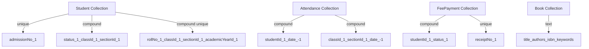

# 3. Database Design & Schema

This chapter defines the MongoDB configuration, entity schemas, and indexing strategy using Mongoose ODM.

## 3.1 Database Configuration

### 3.1.1 MongoDB Connection Setup

The `config/database.js` connection configures pooling (`poolSize: 10`), exponential backoff retry (1s start, 30s cap, 5 attempts), and `strictQuery: true` for Mongoose 8.x compatibility. Production uses replica sets with `readPreference=secondaryPreferred`.

### 3.1.2 Database Seeding Strategy

The `scripts/seed.js` bootstrap creates academic years, classes Grade 1–12 with sections A–D, core subjects, a `super_admin` user, and 200 sample students via `insertMany` with `ordered: false`.

### 3.1.3 Migration Strategy

Schema evolution uses `migrate-mongo` with state stored in a `changelog` collection. Migrations export `up` and `down` functions following the `YYYYMMDDHHMMSS-descriptive-name.js` convention, wrapping multi-document changes in transactions.

## 3.2 Core Entity Schema Definitions

### 3.2.1 User Schema

All schemas include `createdAt`/`updatedAt` timestamps and `.trim()` on String fields. The User schema anchors authentication with a restricted `role` enum.

```javascript
// src/models/User.js
const mongoose = require('mongoose');
const bcrypt = require('bcrypt');

const SALT_ROUNDS = 12;

const userSchema = new mongoose.Schema({
  email: {
    type: String, required: [true, 'Email is required'],
    unique: true, lowercase: true, trim: true,
    match: [/^\S+@\S+\.\S+$/, 'Invalid email format']
  },
  password: {
    type: String, required: [true, 'Password is required'],
    minlength: [8, 'Password must be at least 8 characters'],
    select: false
  },
  role: {
    type: String,
    enum: ['super_admin', 'admin', 'teacher', 'student', 'parent',
           'accountant', 'librarian', 'transport_manager', 'warden'],
    required: true, index: true
  },
  status: {
    type: String, enum: ['active', 'inactive', 'suspended'],
    default: 'active'
  },
  lastLogin: { type: Date, default: null }
}, { timestamps: true });

userSchema.index({ role: 1, status: 1 });

userSchema.pre('save', async function(next) {
  if (!this.isModified('password')) return next();
  this.password = await bcrypt.hash(this.password, SALT_ROUNDS);
  next();
});

userSchema.methods.comparePassword = async function(candidate) {
  return bcrypt.compare(candidate, this.password);
};

module.exports = mongoose.model('User', userSchema);
```

The `select: false` option prevents password leakage unless explicitly requested with `.select('+password')`. The `{ role: 1, status: 1 }` compound index optimizes active user lookups.

### 3.2.2 Student Schema

The Student schema stores personal and enrollment data, referencing Class, Section, and AcademicYear rather than embedding them.

```javascript
// src/models/Student.js
const mongoose = require('mongoose');

const addressSchema = new mongoose.Schema({
  addressType: { type: String, enum: ['permanent', 'correspondence'], required: true },
  street: { type: String, required: true, trim: true },
  city: { type: String, required: true, trim: true },
  state: { type: String, required: true, trim: true },
  postalCode: { type: String, required: true, trim: true },
  country: { type: String, default: 'India', trim: true },
  isPrimary: { type: Boolean, default: false }
}, { _id: true });

const studentSchema = new mongoose.Schema({
  admissionNo: { type: String, required: true, unique: true, immutable: true, trim: true },
  rollNo: { type: String, required: true, trim: true },
  firstName: { type: String, required: true, trim: true },
  lastName: { type: String, required: true, trim: true },
  dob: { type: Date, required: true },
  gender: { type: String, enum: ['male', 'female', 'other'], required: true },
  bloodGroup: { type: String, enum: ['A+', 'A-', 'B+', 'B-', 'AB+', 'AB-', 'O+', 'O-'] },
  photoUrl: { type: String, default: null },
  classId: { type: mongoose.Schema.Types.ObjectId, ref: 'Class', required: true, index: true },
  sectionId: { type: mongoose.Schema.Types.ObjectId, ref: 'Section', required: true, index: true },
  academicYearId: { type: mongoose.Schema.Types.ObjectId, ref: 'AcademicYear', required: true },
  addresses: [addressSchema],
  guardianIds: [{ type: mongoose.Schema.Types.ObjectId, ref: 'Guardian' }],
  enrollmentDate: { type: Date, default: Date.now },
  admissionType: { type: String, enum: ['new', 'transfer', 'readmission'], default: 'new' },
  previousSchool: { type: String, trim: true },
  medicalNotes: { type: String, default: '', trim: true },
  specialNeeds: { type: String, default: '', trim: true },
  status: {
    type: String, enum: ['active', 'inactive', 'transferred', 'withdrawn', 'alumni'],
    default: 'active', index: true
  }
}, { timestamps: true });

studentSchema.index({ rollNo: 1, classId: 1, sectionId: 1, academicYearId: 1 }, { unique: true });
studentSchema.index({ status: 1, classId: 1, sectionId: 1 });

module.exports = mongoose.model('Student', studentSchema);
```

Addresses embed (cardinality bounded at two, always queried with student). Guardian IDs reference (guardians link to multiple students). `immutable: true` on `admissionNo` prevents changes; the unique compound index `{ rollNo, classId, sectionId, academicYearId }` enforces roll uniqueness per class-section-year.

### 3.2.3 Teacher and Guardian Schemas

The **Teacher** schema (`Staff`) extends User via `userId`. Fields: `staffId` (`EMP-YYYY-SEQUENCE`), `qualifications`, `subjectSpecializations`, `department`, `joiningDate`, `employmentType` enum, `salaryDetails` (embedded), `assignedClasses`, and `biometricId`. Salary embeds because it is always accessed with the staff record.

The **Guardian** schema links to multiple students via `studentIds`. The `relationship` enum is `['father', 'mother', 'guardian']`, `priorityOrder` sets notification precedence, and `isEmergencyContact` flags the crisis contact. A unique index on `phone` enforces distinct numbers.

## 3.3 Academic Entity Schemas

### 3.3.1 Class Schema

Classes represent grade levels; sections embed as sub-documents (typically A–D) because they belong exclusively to one class. Each section stores `name`, `capacity` (default 40), `classTeacherId`, `roomNumber`, and `status`.

### 3.3.2 Subject and Timetable Schemas

The **Subject** schema defines `name`, `code`, `type` enum (`core`, `elective`, `co-curricular`), `credits`, and `classIds`. Core subjects require 5 periods per week, electives 3, co-curricular 2.

The **Timetable** schema stores entries as sub-documents with `dayOfWeek`, `periodNo`, `startTime`, `endTime`, `subjectId`, `teacherId`, `classId`, `sectionId`, and `isSubstitution`. A compound index on `{ classId: 1, sectionId: 1, academicYearId: 1 }` optimizes lookups.

## 3.4 Transactional and Auxiliary Schemas

### 3.4.1 Attendance Schema

Attendance records daily and subject-wise records. `subjectId` is null for daily tracking, populated for subject-wise.

```javascript
// src/models/Attendance.js
const mongoose = require('mongoose');

const attendanceSchema = new mongoose.Schema({
  studentId: { type: mongoose.Schema.Types.ObjectId, ref: 'Student', required: true, index: true },
  date: { type: Date, required: true, index: true },
  status: { type: String, enum: ['present', 'absent', 'late', 'half-day', 'excused'], required: true },
  subjectId: { type: mongoose.Schema.Types.ObjectId, ref: 'Subject', default: null },
  classId: { type: mongoose.Schema.Types.ObjectId, ref: 'Class', required: true },
  sectionId: { type: mongoose.Schema.Types.ObjectId, required: true },
  markedBy: { type: mongoose.Schema.Types.ObjectId, ref: 'User', required: true },
  markedVia: { type: String, enum: ['manual', 'biometric', 'rfid', 'mobile_app', 'bulk_upload'], default: 'manual' },
  remarks: { type: String, maxlength: 500, trim: true },
  isRegularized: { type: Boolean, default: false },
  academicYearId: { type: mongoose.Schema.Types.ObjectId, ref: 'AcademicYear', required: true }
}, { timestamps: true });

attendanceSchema.index({ studentId: 1, date: -1 });
attendanceSchema.index({ classId: 1, sectionId: 1, date: -1 });

module.exports = mongoose.model('Attendance', attendanceSchema);
```

The `{ studentId: 1, date: -1 }` compound index optimizes attendance history lookups. `isRegularized` tracks corrections requiring admin approval.

### 3.4.2 Examination Schemas

The examination module uses three schemas: **Exam** (session definition), **ExamSchedule** (subject-wise scheduling), and **Marks** (student results). Exam defines `name`, `type` enum, `startDate`, `endDate`, and `academicYearId`. ExamSchedule links exams to subjects with `examId`, `subjectId`, `date`, `startTime`, `endTime`, `maxMarks`, and `passingMarks`. Marks stores `studentId`, `examScheduleId`, `marksObtained`, `grade`, `gradePoint`, `status` (`entered`, `verified`, `finalized`), and audit fields. A unique index on `{ studentId: 1, examScheduleId: 1 }` prevents duplicates.

### 3.4.3 Fee Schema

The fee module uses three schemas. **FeeHead** defines categories (`name`, `type` enum, `frequency`). **FeeStructure** links FeeHead to a class (`classId`, `feeHeadId`, `amount`, effective dates). **FeePayment** records transactions:

```javascript
// src/models/FeePayment.js
const mongoose = require('mongoose');

const feePaymentSchema = new mongoose.Schema({
  studentId: { type: mongoose.Schema.Types.ObjectId, ref: 'Student', required: true },
  feeStructureId: { type: mongoose.Schema.Types.ObjectId, ref: 'FeeStructure', required: true },
  amountPaid: { type: Number, required: true, min: 0 },
  paymentMode: { type: String, enum: ['cash', 'cheque', 'dd', 'upi', 'card', 'bank_transfer'], required: true },
  transactionId: { type: String, trim: true, default: null },
  receiptNo: { type: String, required: true, unique: true, trim: true },
  status: { type: String, enum: ['pending', 'completed', 'failed', 'refunded', 'cancelled'], default: 'pending' },
  academicYearId: { type: mongoose.Schema.Types.ObjectId, ref: 'AcademicYear', required: true },
  collectedBy: { type: mongoose.Schema.Types.ObjectId, ref: 'User', required: true },
  remarks: { type: String, trim: true, maxlength: 500 }
}, { timestamps: true });

feePaymentSchema.index({ studentId: 1, status: 1 });
feePaymentSchema.index({ createdAt: -1, status: 1 });

module.exports = mongoose.model('FeePayment', feePaymentSchema);
```

The unique `receiptNo` index enforces sequential numbering for audit compliance. The `{ studentId: 1, status: 1 }` compound index accelerates outstanding fee queries. `transactionId` stores payment gateway references for reconciliation.

### 3.4.4 Library Schemas

The **Book** schema stores `title`, `authors`, `isbn`, `publisher`, `publicationYear`, `categoryId`, `classificationNo`, `totalCopies`, `availableCopies`, and `keywords`. A text index on `title`, `authors`, `isbn`, and `keywords` powers `$text` search. The **BookIssue** schema tracks circulation with `bookCopyId`, `userId`, `issueDate`, `dueDate`, `returnDate`, `fineAmount`, and `status`. An index on `{ userId: 1, status: 1 }` finds active loans to enforce issue limits.

## 3.5 Schema Relationships and Indexing

### 3.5.1 Referencing vs. Embedding Decision Matrix

| Relationship Pattern | Strategy | Example | Rationale |
|---|---|---|---|
| 1:1 | **Embed** | Address within Student | Always accessed together; limited cardinality |
| 1:few (< 10) | **Embed** | Sections within Class | Bounded growth; atomic updates with parent |
| 1:many (> 10) | **Reference** | Attendance records → Student | Unbounded growth; avoids document bloat |
| Many:many | **Reference** | Teachers ↔ Classes via Timetable | Both sides query independently |
| Audit/history | **Reference (separate)** | FeePayment → Student | Immutable records; separate access patterns |
| Hierarchical | **Reference with parentId** | BookCategory tree | Self-referencing for arbitrary depth |

This framework is illustrated by addresses (embed, max two) versus guardians (reference, link to multiple students).

### 3.5.2 Critical Indexes and Entity Relationships

The following ER diagram shows the primary relationships across all modules:

```mermaid
erDiagram
    USER ||--o{ STUDENT : "authenticates"
    USER ||--o{ STAFF : "authenticates"
    USER ||--o{ GUARDIAN : "authenticates"
    STUDENT ||--o{ ATTENDANCE : "has"
    STUDENT ||--o{ FEE_PAYMENT : "pays"
    STUDENT ||--o{ MARKS : "receives"
    STUDENT }o--o{ GUARDIAN : "linked via guardianIds"
    STUDENT }o--|| CLASS : "enrolled in"
    STUDENT }o--|| SECTION : "assigned to"
    CLASS ||--o{ SECTION : "contains"
    CLASS ||--o{ FEE_STRUCTURE : "charged"
    TIMETABLE ||--o{ TIMETABLE_ENTRY : "entries"
    TIMETABLE_ENTRY }o--|| SUBJECT : "teaches"
    TIMETABLE_ENTRY }o--|| STAFF : "assigned"
    EXAM ||--o{ EXAM_SCHEDULE : "schedules"
    EXAM_SCHEDULE ||--o{ MARKS : "records"
    EXAM_SCHEDULE }o--|| SUBJECT : "tests"
    BOOK ||--o{ BOOK_ISSUE : "circulates"
    STUDENT ||--o{ BOOK_ISSUE : "borrows"
    ACADEMIC_YEAR ||--o{ CLASS : "hosts"
```

Student sits at the center connecting to attendance, fees, marks, library, and guardian records. Crow's feet denote one-to-many; circles on both ends indicate many-to-many associations.



Critical cross-cutting indexes include: Attendance `{ studentId: 1, date: -1 }` for monthly percentage calculations; Student unique `admissionNo`; FeePayment `{ studentId: 1, status: 1 }` for defaulters reports; and Book text index for catalog search. Production indexes use `background: true`.

### 3.5.3 Cascade Delete and Data Integrity

MongoDB lacks foreign key constraints, so integrity is enforced at the application layer. A `deletedAt` field implements soft deletion. The `pre('remove')` hook on Student checks for dependent records and throws `DependencyError` if any exist.

Multi-document operations wrap in MongoDB transactions via `mongoose.startSession()`. Start a session, execute writes within it, commit on success, or abort on error. This ensures fee payments and receipts remain synchronized.
