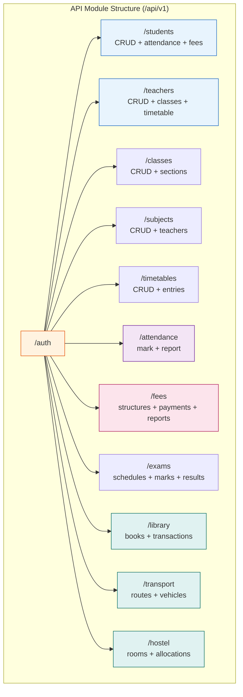
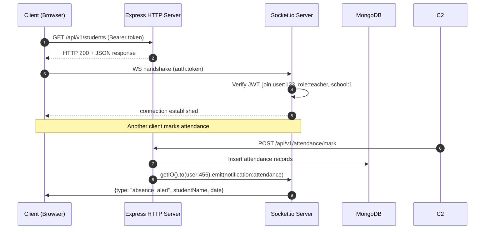

## 4. Backend Architecture & API Design

### 4.1 Node.js Application Architecture

The SMS backend is a monolithic Express.js application organized into four layers: HTTP handling (routes and controllers), business logic (services), data access (Mongoose models), and cross-cutting utilities (middleware, validators, helpers). This separation enforces single-responsibility principles and enables unit testing of each layer in isolation. The application bootstraps through `server.js`, which initializes the Express app, mounts the middleware pipeline, registers modular routes, attaches global error handling, and starts the HTTP listener.

#### 4.1.1 Express.js Bootstrap

The `server.js` entry point creates the Express application, establishes the MongoDB connection, mounts middleware, registers routes under `/api/v1`, and starts the server. Process-level handlers for unhandled promise rejections and uncaught exceptions trigger graceful shutdown with a non-zero exit code, preventing silent failures in production.

```javascript
// server.js
const express = require('express');
const mongoose = require('mongoose');
const { createServer } = require('http');
const config = require('./config/env');
const { mountMiddleware } = require('./middleware');
const routes = require('./routes');
const { globalErrorHandler } = require('./middleware/error.middleware');
const { logger } = require('./utils/logger');

const app = express();
const httpServer = createServer(app);

// Database connection with connection pooling
mongoose.connect(config.databaseUrl, { maxPoolSize: 10 })
  .then(() => logger.info('MongoDB connected'))
  .catch((err) => { logger.error('MongoDB connection failed', err); process.exit(1); });

// Middleware pipeline, routes, and error handler
mountMiddleware(app);
app.use('/api/v1', routes);
app.use(globalErrorHandler);

const PORT = config.port || 5000;
httpServer.listen(PORT, () => logger.info(`Server running on port ${PORT}`));

// Process-level safeguards
process.on('unhandledRejection', (reason) => {
  logger.error('Unhandled Rejection', { reason });
  httpServer.close(() => process.exit(1));
});
process.on('uncaughtException', (error) => {
  logger.error('Uncaught Exception', { error: error.message, stack: error.stack });
  httpServer.close(() => process.exit(1));
});
```

#### 4.1.2 Middleware Pipeline

Every request traverses a fixed middleware chain before reaching a route handler. The sequence matters: security headers execute first, followed by request parsing and sanitization, then authentication and logging, then route handlers, and finally error handling at the end.

```mermaid
flowchart LR
    A["Helmet<br/>security headers"] --> B["Compression<br/>gzip response"]
    B --> C["CORS<br/>origin policy"] --> D["Request ID<br/>uuid injection"]
    D --> E["Morgan<br/>HTTP logging"] --> F["express.json()<br/>body parsing"]
    F --> G["mongoSanitize<br/>NoSQL injection guard"]
    G --> H["xssClean<br/>script tag removal"]
    H --> I["Route Handlers<br/>/api/v1/*"]
    I --> J["globalErrorHandler<br/>response formatting"]
    style A fill:#e8f4fd,stroke:#1976d2
    style F fill:#e8f5e9,stroke:#388e3c
    style G fill:#fce4ec,stroke:#c62828
    style I fill:#f3e5f5,stroke:#7b1fa2
    style J fill:#ffebee,stroke:#b71c1c
```



Helmet sets Content-Security-Policy, HSTS, and X-Content-Type-Options headers. Compression reduces JSON payload sizes for large collection responses. CORS restricts cross-origin access to whitelisted domains. A custom request-ID middleware injects a `x-request-id` header for distributed tracing. `express-mongo-sanitize` removes `$` and `.` characters from request bodies to prevent NoSQL injection, and `xss-clean` strips script tags to mitigate XSS attacks.

#### 4.1.3 Centralized Error Handling

The backend distinguishes **operational errors** (expected conditions such as invalid input or missing resources) from **programming errors** (unexpected bugs such as null dereferences). The `AppError` class extends `Error` and carries an HTTP status code and an `isOperational` flag. The global error middleware intercepts all thrown errors, checks the error type, and formats a consistent JSON response. Mongoose-specific errors — ValidationError, duplicate key (code 11000), CastError — are converted to operational errors with appropriate status codes.

```javascript
// utils/AppError.js & middleware/error.middleware.js
class AppError extends Error {
  constructor(message, statusCode) {
    super(message);
    this.statusCode = statusCode;
    this.status = `${statusCode}`.startsWith('4') ? 'fail' : 'error';
    this.isOperational = true;
    Error.captureStackTrace(this, this.constructor);
  }
}

const globalErrorHandler = (err, req, res, next) => {
  err.statusCode = err.statusCode || 500;

  if (err.isOperational) {
    return res.status(err.statusCode).json({ success: false, message: err.message, status: err.status });
  }
  // Mongoose error translations
  if (err.name === 'ValidationError') {
    const msgs = Object.values(err.errors).map(e => e.message);
    return res.status(400).json({ success: false, message: `Validation failed: ${msgs.join('. ')}` });
  }
  if (err.code === 11000) {
    const field = Object.keys(err.keyValue)[0];
    return res.status(409).json({ success: false, message: `Duplicate value for ${field}` });
  }
  if (err.name === 'CastError') {
    return res.status(400).json({ success: false, message: `Invalid ${err.path}: ${err.value}` });
  }
  if (err.name === 'JsonWebTokenError' || err.name === 'TokenExpiredError') {
    return res.status(401).json({ success: false, message: 'Invalid or expired token' });
  }
  res.status(500).json({ success: false, message: 'Internal server error' });
};

module.exports = { AppError, globalErrorHandler };
```

#### 4.1.4 Async Handler Wrapper

The `catchAsync` utility wraps async route handlers, automatically catching rejected promises and forwarding errors to the global error middleware via `next(err)`. This eliminates repetitive `try-catch` blocks across every controller function.

```javascript
// utils/catchAsync.js
const catchAsync = (fn) => (req, res, next) => fn(req, res, next).catch(next);

const handleAsync = (fn, statusCode = 200) => (req, res, next) => {
  fn(req, res, next).then((data) => {
    res.status(statusCode).json({ success: true, data, message: data?.message || 'Success', meta: data?.meta || null });
  }).catch(next);
};

module.exports = { catchAsync, handleAsync };
```

### 4.2 Modular Routing Structure

The backend organizes routes by domain module — each functional area has its own route file, controller directory, service layer, and Mongoose model. All module routes aggregate through a single `routes/index.js` registry mounted under `/api/v1`.

#### 4.2.1 Route Aggregation

The index router imports every module-level router and mounts it at a logical sub-path. This central registry is the single source of truth for all API endpoints and ensures a consistent versioning strategy.

```javascript
// routes/index.js
const express = require('express');
const router = express.Router();

router.use('/auth', require('./auth.routes'));
router.use('/students', require('./student.routes'));
router.use('/teachers', require('./teacher.routes'));
router.use('/classes', require('./class.routes'));
router.use('/sections', require('./section.routes'));
router.use('/subjects', require('./subject.routes'));
router.use('/timetables', require('./timetable.routes'));
router.use('/attendance', require('./attendance.routes'));
router.use('/fees', require('./fee.routes'));
router.use('/exams', require('./exam.routes'));
router.use('/library', require('./library.routes'));
router.use('/transport', require('./transport.routes'));
router.use('/hostel', require('./hostel.routes'));
router.use('/announcements', require('./announcement.routes'));

module.exports = router;
```

#### 4.2.2 Controller-Service-Repository Pattern

Controllers remain thin, handling only HTTP concerns: extracting request parameters, delegating to services, and returning responses. Services encapsulate business logic and cross-model coordination. Models (through Mongoose) provide data access and schema-level constraints. For example, a student creation controller extracts the request body, calls `StudentService.create()`, and returns the result. The service validates business rules (admission number uniqueness, age requirements) before persisting via `Student.create()`.

#### 4.2.3 Route Protection

Each route applies a middleware chain of authentication, authorization, and validation. The `authenticate` middleware verifies the JWT from the `Authorization: Bearer <token>` header and attaches the decoded user to `req.user`. The `authorize(roles...)` factory checks `req.user.role` against an allowed array and returns `403 Forbidden` for unauthorized access. The `validate(schema)` middleware runs Joi validation against `req.body` and returns `400 Bad Request` with field-level errors.

### 4.3 RESTful API Endpoint Design

The SMS API follows REST conventions: plural nouns for resources (`/students`, `/teachers`), nested sub-resources (`/classes/:id/sections`), and HTTP method mapping to CRUD semantics (POST create, GET read, PUT/PATCH update, DELETE remove). Query parameters handle filtering (`?status=active`), sorting (`?sort=-createdAt`), and pagination (`?page=2&limit=25`).

#### 4.3.1 Resource Naming Conventions

Actions that do not map cleanly to CRUD use POST endpoints with descriptive sub-resource paths: `POST /attendance/mark` for bulk marking, `POST /teachers/:id/assign-class` for class assignment. Collection endpoints support list operations with filtering and pagination. Nested endpoints expose related data without requiring separate queries, reducing client round-trips.

#### 4.3.2 API Endpoint Reference

The following table catalogs the primary Student module endpoints.

| Method | Endpoint | Required Role | Description |
|--------|----------|---------------|-------------|
| GET | `/students` | Admin, Teacher, Principal | List students with pagination; filter by class, section, status, search by name or admission number |
| GET | `/students/:id` | Admin, Teacher, Student (self), Parent | Retrieve student profile with guardian and address details |
| POST | `/students` | Admin, Admission Officer | Enroll a new student; validates admission number uniqueness and age requirements |
| PUT | `/students/:id` | Admin, Teacher | Full update of student profile including address and guardian information |
| DELETE | `/students/:id` | Admin | Soft-delete; blocked if fee dues or active library transactions exist |
| GET | `/students/:id/attendance` | Admin, Teacher, Student, Parent | Monthly attendance summary with percentage calculation |
| GET | `/students/:id/fees` | Admin, Accountant, Student, Parent | Fee ledger: invoices, receipts, outstanding balance, payment history |

#### 4.3.3 Teacher Endpoints

Teacher endpoints follow the same CRUD pattern with sub-resources: `GET /teachers/:id/classes` returns assigned class-sections, `GET /teachers/:id/timetable` returns the weekly schedule, `POST /teachers/:id/assign-class` links a teacher to a section (validating no timetable conflicts), and `GET /teachers/:id/workload` aggregates periods per week.

#### 4.3.4 Academic Endpoints

The `/classes` collection supports full CRUD; `GET /classes/:id/sections` enumerates sections and `POST /classes/:id/sections` creates one with automatic class teacher assignment. `/subjects` supports category filtering (`?category=core|elective|co-curricular`). `/timetables` stores timetable headers, and `/timetables/:id/entries` manages schedule rows with teacher and room availability validation.

#### 4.3.5 Attendance Endpoints

`POST /attendance/mark` accepts a bulk array of `{ studentId, classSectionId, date, status, subjectId?, remarks? }` and enforces uniqueness per student per date. `GET /attendance/report` generates class-wise summaries with present, absent, and late counts. `PUT /attendance/:id` allows corrections within a 7-day window; later changes require admin approval.

#### 4.3.6 Fee Endpoints

`/fee-structures` manages class-wise and category-wise fee amounts. `POST /fee-payments/record` records a payment with mode, amount, and transaction reference, auto-generating a unique receipt number. `GET /fee-payments/receipt/:receiptNo` retrieves receipt details for reprinting. `GET /fees/reports/outstanding` generates aging analysis (0-30, 31-60, 61-90, 90+ days past due).

#### 4.3.7 Auxiliary Module Endpoints

Library management provides `GET /library/books` (catalog search), `POST /library/transactions/issue` (issuance with due-date calculation), and `POST /library/transactions/:id/return` (return with automatic fine computation). Transport offers `/transport/routes` and `/transport/vehicles` with stop sequencing. Hostel exposes `/hostel/rooms` (with vacancy status) and `/hostel/allocations` for room assignment.



### 4.4 Request Validation & Sanitization

All incoming data passes through validation and sanitization before reaching controller logic. `express-mongo-sanitize` replaces `$` and `.` characters in request bodies to prevent NoSQL injection. `xss-clean` strips HTML script tags to mitigate XSS. All string inputs receive `.trim()` treatment through Joi to eliminate whitespace-related query failures.

#### 4.4.1 Joi Validation Schemas

Joi defines schemas for every write operation, chaining constraints such as `.required()`, `.email()`, `.min()`, `.max()`, and `.valid()`. Custom validators handle domain-specific rules: phone numbers use E.164 regex patterns, and a custom `objectIdValidator` checks MongoDB identifier format.

```javascript
// validators/student.validator.js
const Joi = require('joi');
const { objectIdValidator } = require('./customValidators');

const phoneRegex = /^\+?[1-9]\d{1,14}$/;

const studentCreateSchema = Joi.object({
  firstName: Joi.string().trim().min(2).max(50).required(),
  lastName: Joi.string().trim().min(2).max(50).required(),
  email: Joi.string().trim().email().lowercase().max(100),
  phone: Joi.string().trim().pattern(phoneRegex).required(),
  dateOfBirth: Joi.date().iso().max('now').required(),
  gender: Joi.string().valid('male', 'female', 'other').required(),
  bloodGroup: Joi.string().valid('A+', 'A-', 'B+', 'B-', 'AB+', 'AB-', 'O+', 'O-'),
  admissionNumber: Joi.string().trim().alphanum().min(5).max(20).required(),
  rollNumber: Joi.string().trim().alphanum().max(15),
  classId: Joi.string().custom(objectIdValidator).required(),
  sectionId: Joi.string().custom(objectIdValidator).required(),
  academicYearId: Joi.string().custom(objectIdValidator).required(),
  category: Joi.string().valid('general', 'sc', 'st', 'obc', 'other').default('general'),
  address: Joi.object({
    street: Joi.string().trim().max(200).required(),
    city: Joi.string().trim().max(100).required(),
    state: Joi.string().trim().max(100).required(),
    postalCode: Joi.string().trim().pattern(/^\d{6}$/).required(),
    country: Joi.string().trim().max(50).default('India'),
  }).required(),
  guardians: Joi.array().items(Joi.object({
    name: Joi.string().trim().min(2).max(100).required(),
    relationship: Joi.string().valid('father', 'mother', 'guardian').required(),
    phone: Joi.string().pattern(phoneRegex).required(),
    email: Joi.string().email().lowercase(),
    isPrimaryContact: Joi.boolean().default(false),
  })).min(1).max(5).required(),
  admissionType: Joi.string().valid('new', 'transfer', 'readmission').default('new'),
}).options({ stripUnknown: true });

module.exports = { studentCreateSchema };
```

### 4.5 Response Standardization

Every API response follows a uniform envelope: `{ success: boolean, data: object|null, message: string, meta: { page, limit, total } }`. Controllers use the `sendResponse` utility rather than calling `res.json()` directly, ensuring predictable response shapes across all endpoints. List endpoints accept `page` and `limit` query parameters (defaults: page=1, limit=25, max=100), compute `skip = (page - 1) * limit` for MongoDB queries, and include pagination metadata so the frontend can render accurate page controls.

The API adheres to strict HTTP status code conventions: `200 OK` for successful GET/PUT/PATCH, `201 Created` for resource creation via POST, `204 No Content` for successful DELETE, `400 Bad Request` for validation failures, `401 Unauthorized` for missing or invalid credentials, `403 Forbidden` for insufficient role permissions, `404 Not Found` for missing resources, `409 Conflict` for business-rule violations such as duplicate admission numbers, and `500 Internal Server Error` for unexpected failures.

### 4.6 WebSocket Integration

Real-time features — attendance notifications, fee payment status, admin announcements, and messaging — use Socket.io integrated with the Express HTTP server. The Socket.io initialization module authenticates each connection using the same JWT access token, rejecting unauthorized sockets before they join any rooms.

Each authenticated socket joins three room categories on connection: a personal room (`user:${userId}`) for targeted notifications, a role room (`role:${role}`) for broadcast messages to all teachers, parents, or administrators, and a school room (`school:${schoolId}`) for institution-wide announcements. The `emit` method sends to specific rooms, `broadcast.emit` sends to all sockets except the sender, and `io.emit` sends globally. This room architecture ensures sensitive data never leaks to unintended recipients.

Event namespaces organize real-time traffic logically: `notification:*` for system alerts and fee reminders, `attendance:*` for real-time marking updates, `chat:*` for messaging, and `presence:*` for online status tracking. Controllers emit events through a service-layer pattern — after the attendance service marks a student absent, it emits a targeted notification to the guardian's personal room, keeping WebSocket logic decoupled from business logic.


