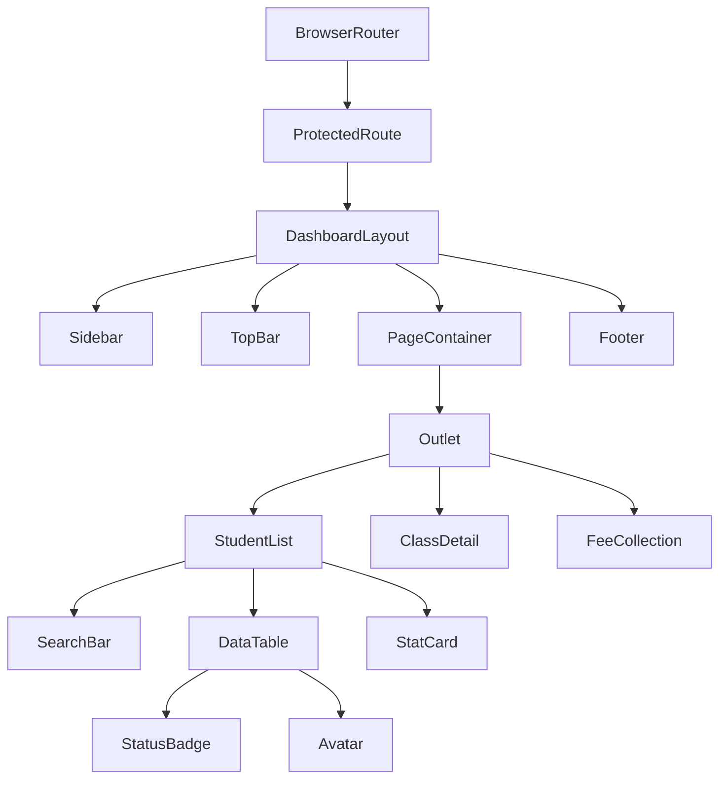
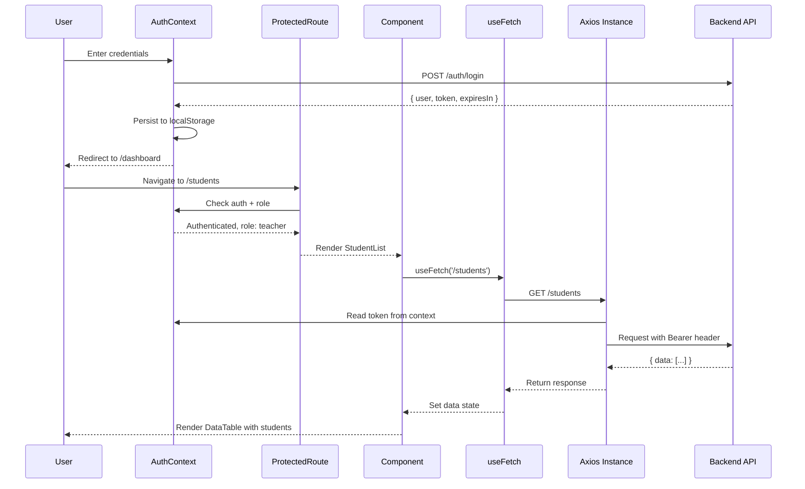

## 5. Frontend Architecture — React

The School Management System frontend is a single-page application (SPA) built with React 18, Vite, and Tailwind CSS. It consumes the RESTful API from Chapter 4 and presents a role-adaptive interface for eight user personas. This chapter covers project scaffolding, component architecture, routing, state management, reusable components, API integration, and UI/UX implementation.

### 5.1 React Application Structure

#### 5.1.1 Vite Project Setup

The project is scaffolded with `npm create vite@latest sms-client -- --template react`. Absolute imports are configured via `jsconfig.json`:

```javascript
// jsconfig.json
{
  "compilerOptions": {
    "baseUrl": ".",
    "paths": { "@/*": ["src/*"] }
  },
  "include": ["src"]
}
```

Environment variables use Vite's `import.meta.env` convention — variables prefixed with `VITE_` are exposed to client-side code.

#### 5.1.2 Atomic Design Methodology

Components use Atomic Design hierarchy. **Atoms** are indivisible — `Button`, `Input`, `Icon`. **Molecules** combine atoms: `SearchBar` (Input + Button), `FormField` (Label + Input + Error). **Organisms** are self-contained sections: `DataTable`, `Sidebar`. **Templates** define layouts: `DashboardLayout`. **Pages** are domain instances: `StudentList`, `ClassDetail`.

#### 5.1.3 Feature-Based Folder Structure

```
src/
  features/students/       components/, hooks/, services/, utils/
  features/teachers/       components/, hooks/, services/, utils/
  features/academics/      components/, hooks/, services/, utils/
  components/              shared atoms, molecules, organisms
  context/                 React context providers
  hooks/                   global custom hooks
  services/                Axios instance and interceptors
  pages/                   top-level route components
  router/                  route definitions and guards
```

Adding a module means creating one folder; cross-cutting concerns live in shared directories.

### 5.2 Routing and Navigation

#### 5.2.1 React Router v6

Routing uses React Router v6 with `BrowserRouter`. Nested routes exploit `Outlet` for layout composition. `useParams` extracts path variables; `useSearchParams` manages query strings.

#### 5.2.2 Role-Based Route Guards

`ProtectedRoute` reads `AuthContext` and checks the user's role against a `requiredRoles` prop. Unauthenticated users redirect to `/login`; unauthorized users redirect to `/unauthorized`.

#### 5.2.3 Dynamic Navigation

`Sidebar` menu items are filtered by role via `useMenuItems`. Breadcrumbs derive from route hierarchy. Active highlighting uses `NavLink`'s `isActive` flag.

#### 5.2.4 Code Splitting

Route-level components load with `React.lazy()`, wrapped in `Suspense` with skeleton fallbacks. `IntersectionObserver` prefetches likely next routes on hover.

### 5.3 State Management

#### 5.3.1 AuthContext

`AuthContext` exposes `user`, `role`, `token`, `login()`, and `logout()`. On mount it hydrates from `localStorage` and schedules logout before JWT expiry.

```jsx
// src/context/AuthContext.jsx
import { createContext, useContext, useState, useEffect, useCallback } from 'react';
import { useNavigate } from 'react-router-dom';

const AuthContext = createContext(null);

export function AuthProvider({ children }) {
  const [user, setUser] = useState(null);
  const [token, setToken] = useState(null);
  const [isLoading, setIsLoading] = useState(true);
  const navigate = useNavigate();

  useEffect(() => {
    const stored = localStorage.getItem('sms_auth');
    if (stored) {
      const parsed = JSON.parse(stored);
      if (parsed.expiresAt - Date.now() > 60000) {
        setUser(parsed.user);
        setToken(parsed.token);
      } else {
        localStorage.removeItem('sms_auth');
      }
    }
    setIsLoading(false);
  }, []);

  const login = useCallback(async (email, password) => {
    const res = await fetch('/api/v1/auth/login', {
      method: 'POST',
      headers: { 'Content-Type': 'application/json' },
      body: JSON.stringify({ email, password })
    });
    if (!res.ok) throw new Error('Invalid credentials');
    const data = await res.json();
    setUser(data.data.user);
    setToken(data.data.token);
    localStorage.setItem('sms_auth', JSON.stringify({
      user: data.data.user,
      token: data.data.token,
      expiresAt: Date.now() + data.data.expiresIn * 1000
    }));
  }, []);

  const logout = useCallback(() => {
    setUser(null);
    setToken(null);
    localStorage.removeItem('sms_auth');
    navigate('/login');
  }, [navigate]);

  return (
    <AuthContext.Provider value={{ user, role: user?.role, token, login, logout, isLoading }}>
      {children}
    </AuthContext.Provider>
  );
}

export const useAuth = () => useContext(AuthContext);
```

#### 5.3.2 useReducer for Complex State

`useReducer` manages complex local state. The student wizard dispatches `{ type: 'SET_FIELD', step, field, value }`. `DataTable` state — sort, filters, pagination — uses a single reducer.

#### 5.3.3 Custom Hooks

`useFetch` abstracts data fetching with loading, error, and cancellation:

```jsx
// src/hooks/useFetch.js
import { useState, useEffect, useRef, useCallback } from 'react';
import api from '@/services/api';

export function useFetch(url, options = {}) {
  const [data, setData] = useState(null);
  const [loading, setLoading] = useState(true);
  const [error, setError] = useState(null);
  const abortRef = useRef(null);

  const execute = useCallback(async () => {
    if (abortRef.current) abortRef.current.abort();
    const controller = new AbortController();
    abortRef.current = controller;
    setLoading(true);
    setError(null);
    try {
      const response = await api.get(url, { ...options, signal: controller.signal });
      setData(response.data.data);
    } catch (err) {
      if (err.name !== 'AbortError') {
        setError(err.response?.data?.message || 'Failed to load data');
      }
    } finally {
      setLoading(false);
    }
  }, [url, JSON.stringify(options)]);

  useEffect(() => { execute(); return () => abortRef.current?.abort(); }, [execute]);
  return { data, loading, error, refetch: execute };
}
```

Other hooks: `useLocalStorage` for UI preferences, `useDebounce` for 300 ms search delays, `usePermission` for role-based rendering.

#### 5.3.4 Form Handling

All forms use controlled components. Validators — `required`, `email`, `minLength` — return error strings or `null`. `FormField` wraps `Input` with label and error text.

### 5.4 Reusable Component Library

#### 5.4.1 Layout Components

`DashboardLayout` composes `Sidebar`, `TopBar`, `PageContainer`, and `Footer`:

```jsx
// src/components/layout/DashboardLayout.jsx
import { useState } from 'react';
import { Outlet } from 'react-router-dom';
import { Sidebar } from './Sidebar';
import { TopBar } from './TopBar';
import { PageContainer } from './PageContainer';
import { Footer } from './Footer';
import { useAuth } from '@/context/AuthContext';

export function DashboardLayout() {
  const { user } = useAuth();
  const [sidebarOpen, setSidebarOpen] = useState(false);

  return (
    <div className="flex h-screen bg-gray-50">
      <Sidebar isOpen={sidebarOpen} onClose={() => setSidebarOpen(false)} userRole={user?.role} />
      <div className="flex flex-col flex-1 overflow-hidden">
        <TopBar user={user} onMenuClick={() => setSidebarOpen(true)} />
        <main className="flex-1 overflow-y-auto">
          <PageContainer>
            <Outlet />
          </PageContainer>
          <Footer />
        </main>
      </div>
    </div>
  );
}
```

#### 5.4.2 Data Display Components

`DataTable` accepts columns, row data, and selection state; `useTable` manages sorting and pagination. `StatCard` shows KPIs with icon, value, trend. `StatusBadge` maps enums to color-coded pills. `Avatar` shows photos or initials.

#### 5.4.3 Form Components

`InputField` wraps native inputs with validation. `SelectDropdown` supports single/multi selection via Headless UI's `Listbox`. `DatePicker` wraps `react-datepicker`. `FileUploader` provides drag-and-drop with preview.

#### 5.4.4 Feedback Components

Toasts queue in a portal and auto-dismiss after five seconds. `Modal` uses Headless UI's `Dialog` for focus trapping. `ConfirmDialog` handles destructive actions. Skeletons mirror content shape.

### 5.5 API Integration Layer

#### 5.5.1 Axios Instance Configuration

All HTTP flows through a configured Axios instance with interceptors for auth and token refresh:

```javascript
// src/services/api.js
import axios from 'axios';

const api = axios.create({
  baseURL: import.meta.env.VITE_API_BASE_URL || '/api/v1',
  timeout: 30000,
  headers: { 'Content-Type': 'application/json' }
});

let isRefreshing = false;
let failedQueue = [];

const processQueue = (error, token = null) => {
  failedQueue.forEach(prom => error ? prom.reject(error) : prom.resolve(token));
  failedQueue = [];
};

api.interceptors.request.use((config) => {
  const auth = localStorage.getItem('sms_auth');
  if (auth) config.headers.Authorization = `Bearer ${JSON.parse(auth).token}`;
  return config;
});

api.interceptors.response.use(
  (response) => response,
  async (error) => {
    const originalRequest = error.config;
    if (error.response?.status === 401 && !originalRequest._retry) {
      if (isRefreshing) {
        return new Promise((resolve, reject) => {
          failedQueue.push({ resolve, reject });
        }).then(token => {
          originalRequest.headers.Authorization = `Bearer ${token}`;
          return api(originalRequest);
        });
      }
      originalRequest._retry = true;
      isRefreshing = true;
      try {
        const rs = await axios.post('/api/v1/auth/refresh', {}, { withCredentials: true });
        const newToken = rs.data.data.token;
        const stored = JSON.parse(localStorage.getItem('sms_auth'));
        stored.token = newToken;
        localStorage.setItem('sms_auth', JSON.stringify(stored));
        processQueue(null, newToken);
        originalRequest.headers.Authorization = `Bearer ${newToken}`;
        return api(originalRequest);
      } catch (refreshError) {
        processQueue(refreshError, null);
        window.location.href = '/login';
        return Promise.reject(refreshError);
      } finally {
        isRefreshing = false;
      }
    }
    return Promise.reject(error);
  }
);

export default api;
```

#### 5.5.2 Automatic Token Refresh

The interceptor queues concurrent requests in `failedQueue` during `/auth/refresh`. On success they retry; on failure the user redirects to `/login`.

#### 5.5.3 Service Modules

`studentService.js` exports `getStudents(params)`, `getStudentById(id)`, `createStudent(data)` — each returning the standardized `{ success, data, message }` envelope.

#### 5.5.4 Error Handling

API errors map to user-friendly messages. Field-level errors attach to form fields. A React Error Boundary wraps the route tree with a fallback UI.

### 5.6 UI/UX Implementation

#### 5.6.1 Tailwind CSS Integration

Styling follows Tailwind's utility-first approach with custom brand palette: `primary: indigo-600`, `secondary: emerald-500`, `danger: red-500`.

#### 5.6.2 Responsive Design

Mobile-first breakpoints: `sm: 640px`, `md: 768px`, `lg: 1024px`. Sidebar collapses below `md`. Tables switch to card views on mobile.

#### 5.6.3 Theme System

Colors are CSS custom properties; JavaScript toggles the `dark` class for instant dark mode. Inter font family with consistent weights.

#### 5.6.4 State Patterns

Empty states show illustrations with action buttons. Skeletons match content shape. Error states include retry buttons. Optimistic updates apply for attendance; failures roll back with a toast.

### Component Inventory

| Component | Atomic Level | Key Props | Usage Context |
|-----------|-------------|-----------|---------------|
| `Button` | Atom | `variant`, `size`, `loading`, `onClick` | All forms, modals, actions |
| `Input` | Atom | `type`, `placeholder`, `error`, `disabled` | Every form field |
| `Icon` | Atom | `name`, `size`, `color` | Navigation, stats, badges |
| `SearchBar` | Molecule | `value`, `onChange`, `placeholder` | List pages, directory |
| `FormField` | Molecule | `label`, `error`, `helperText`, `children` | All forms |
| `DataTable` | Organism | `columns`, `data`, `sortable`, `selectable` | Student list, fee ledger |
| `Sidebar` | Organism | `menuItems`, `isOpen`, `userRole` | Dashboard layout |
| `DashboardLayout` | Template | — | All authenticated pages |
| `StudentList` | Page | — | `/students` route |
| `ClassDetail` | Page | — | `/classes/:id` route |

### Component Hierarchy



### State Flow


