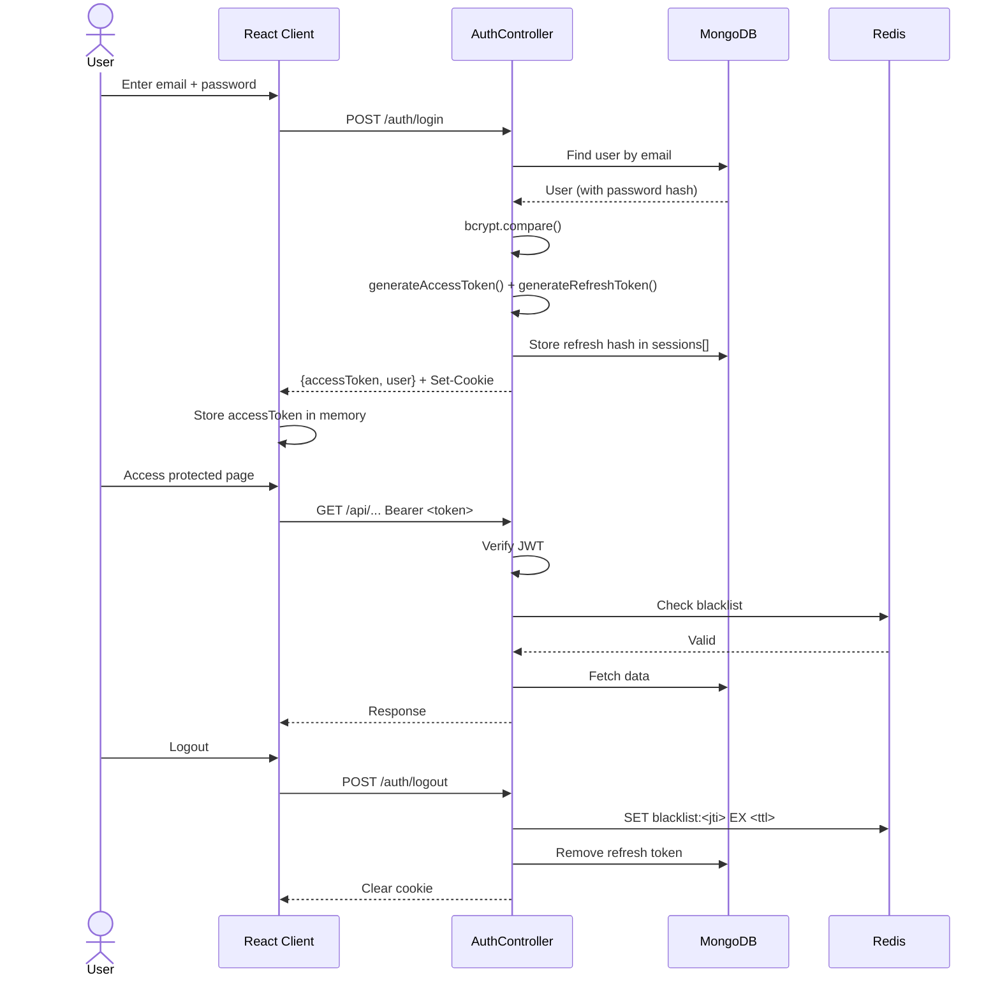
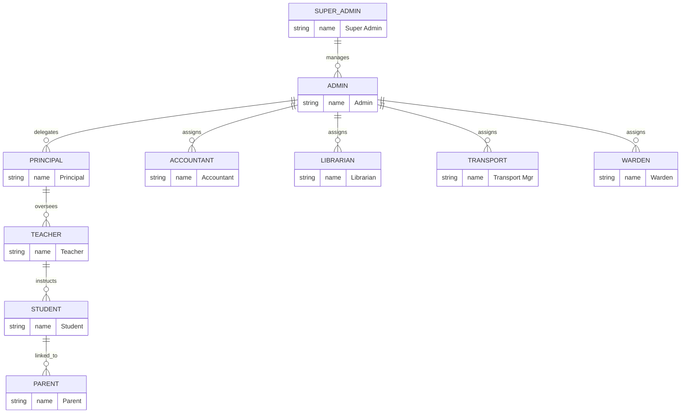

## 6. Authentication & Authorization

The authentication and authorization layer guards every API endpoint and UI route. The design combines password-based authentication with JWT stateless tokens, a ten-role RBAC model, and proactive session management.

### 6.1 Authentication System Design

#### 6.1.1 Authentication Flow

Staff accounts are administrator-created only; students and parents are auto-provisioned during enrollment. On login, the server validates credentials against a bcrypt hash and issues a dual-token pair: a short-lived access token and a long-lived refresh token in an httpOnly cookie.



The refresh token travels only as an httpOnly cookie—JavaScript cannot read it. On logout, the access token's `jti` enters a Redis blacklist with TTL equal to its remaining lifetime, preventing reuse before natural expiry.

#### 6.1.2 Password Hashing

Passwords are hashed with bcrypt at 12 salt rounds. A pre-save Mongoose hook hashes automatically before persistence, and `select: false` on the password field keeps it out of query results unless explicitly requested with `.select('+password')`.

```javascript
// server/models/User.js
import bcrypt from 'bcrypt';
import mongoose from 'mongoose';

const SALT_ROUNDS = 12;

const userSchema = new mongoose.Schema({
  email: { type: String, required: true, unique: true, lowercase: true },
  password: { type: String, required: true, select: false },
  role: {
    type: String,
    enum: ['super_admin', 'admin', 'principal', 'teacher', 'student',
           'parent', 'accountant', 'librarian', 'transport_manager', 'warden'],
    required: true
  },
  schoolId: { type: mongoose.Schema.Types.ObjectId, ref: 'School', index: true },
  status: { type: String, enum: ['active', 'inactive', 'suspended'], default: 'active' },
  sessions: [{ tokenHash: String, createdAt: Date }]
}, { timestamps: true });

userSchema.pre('save', async function (next) {
  if (!this.isModified('password')) return next();
  this.password = await bcrypt.hash(this.password, SALT_ROUNDS);
  next();
});

userSchema.methods.comparePassword = async function (candidate) {
  return bcrypt.compare(candidate, this.password);
};

export const User = mongoose.model('User', userSchema);
```

#### 6.1.3 JWT Token Strategy

The **access token** (15-minute expiry) lives in client memory. The **refresh token** (7-day expiry) is an httpOnly cookie. This limits the blast radius of a compromised access token while avoiding repeated credential prompts.

```javascript
// server/services/tokenService.js
import jwt from 'jsonwebtoken';
import crypto from 'crypto';

export function generateAccessToken(user) {
  return jwt.sign(
    { userId: user._id, role: user.role, schoolId: user.schoolId, type: 'access' },
    process.env.JWT_SECRET,
    { expiresIn: '15m', jwtid: crypto.randomUUID() }
  );
}

export function generateRefreshToken(user) {
  return jwt.sign(
    { userId: user._id, type: 'refresh' },
    process.env.REFRESH_TOKEN_SECRET,
    { expiresIn: '7d', jwtid: crypto.randomUUID() }
  );
}

export function verifyAccessToken(token) {
  return jwt.verify(token, process.env.JWT_SECRET, { clockTolerance: 30 });
}
```

The payload carries `userId`, `role`, and `schoolId` so middleware can perform identity and school-scoped filtering without extra database queries. Each token receives a unique `jti` for precise blacklisting.

#### 6.1.4 Token Blacklisting

On logout, the system stores the access token's `jti` in Redis with TTL matching its remaining lifetime. The `authenticate` middleware checks this blacklist on every request, returning HTTP 401 if revoked. Redis TTL ensures automatic cleanup once the token expires.

### 6.2 Role-Based Access Control (RBAC)

#### 6.2.1 Role Hierarchy

Ten roles are defined, from system-wide authority to module-specific operators: **super_admin** (cross-school), **admin** (single school), **principal** (academic oversight), **teacher**, **student**, **parent**, and specialized staff—**accountant**, **librarian**, **transport_manager**, **warden**.



#### 6.2.2 Permission Matrix

The matrix maps ten roles to eleven modules using CRUD notation. **—** means no access; **R** on student/parent rows denotes self-scoped or child-scoped read; teacher attendance CRU is class-scoped only.

| Role | Student Mgmt | Teacher/Staff | Academic | Attendance | Examination | Fee/Finance | Library | Transport | Hostel | Communication | Reports |
|---|---|---|---|---|---|---|---|---|---|---|---|
| **super_admin** | CRUD | CRUD | CRUD | CRUD | CRUD | CRUD | CRUD | CRUD | CRUD | CRUD | CRUD |
| **admin** | CRUD | CRUD | CRUD | CRUD | CRUD | CRUD | CRUD | CRUD | CRUD | CRUD | RU |
| **principal** | RU | R | RU | R | RU | R | R | R | R | RU | R |
| **teacher** | R | — | R | CRU | RU | — | R | — | — | R | R |
| **student** | R | — | R | R | R | R | R | R | R | R | — |
| **parent** | R | — | R | R | R | R | — | R | R | R | — |
| **accountant** | R | — | — | — | — | CRUD | — | — | — | R | R |
| **librarian** | R | — | — | — | — | — | CRUD | — | — | R | R |
| **transport_manager** | R | — | — | — | — | — | — | CRUD | — | R | R |
| **warden** | R | — | — | R | — | — | — | — | CRUD | R | R |

#### 6.2.3 Backend Authorization Middleware

The `requireRole` factory accepts an array of permitted roles, compares `req.user.role`, and returns HTTP 403 for unauthorized requests.

```javascript
// server/middleware/authorize.js
export function requireRole(allowedRoles) {
  return (req, res, next) => {
    if (!req.user?.role) {
      return res.status(401).json({ success: false, message: 'Authentication required' });
    }
    if (!allowedRoles.includes(req.user.role)) {
      return res.status(403).json({ success: false, message: 'Insufficient permissions' });
    }
    next();
  };
}
```

Usage: `router.get('/fees', authenticate, requireRole(['admin', 'accountant']), getFees)`. A `requireRoleOrOwner` variant supports self-record access without broader role permissions.

#### 6.2.4 Frontend Route Guards

The `ProtectedRoute` component wraps routes requiring authentication or specific roles, redirecting unauthenticated users to `/login` or under-authorized users to `/unauthorized`.

```jsx
// client/src/components/auth/ProtectedRoute.jsx
import { Navigate, useLocation } from 'react-router-dom';
import { useAuth } from '../../context/AuthContext';
import { usePermission } from '../../hooks/usePermission';

export function ProtectedRoute({ element, allowedRoles }) {
  const { user, isAuthenticated, isLoading } = useAuth();
  const location = useLocation();
  const { hasAnyRole } = usePermission();

  if (isLoading) {
    return <div className="flex h-screen items-center justify-center">Loading...</div>;
  }
  if (!isAuthenticated) {
    return <Navigate to="/login" state={{ from: location.pathname }} replace />;
  }
  if (allowedRoles && !hasAnyRole(allowedRoles)) {
    return <Navigate to="/unauthorized" replace />;
  }
  return element;
}
```

The `usePermission` hook provides `hasRole`, `hasAnyRole(roles)`, and `hasRoleOrAbove(minRole)` for conditional UI rendering—hiding buttons or menu items when the user lacks the required role.

### 6.3 Session Management

#### 6.3.1 Token Storage Strategy

The refresh token lives in an httpOnly, Secure, SameSite=Strict cookie—invisible to JavaScript. The access token is stored in a JavaScript variable within the Axios instance. **localStorage is not used for any token**; it persists across tabs and is fully exposed to XSS. This design ensures a successful XSS exploit could only steal a 15-minute access token, not the long-lived refresh credential.

#### 6.3.2 Automatic Token Refresh

When an API request returns HTTP 401 from token expiry, the Axios response interceptor calls `POST /auth/refresh` (sending the httpOnly cookie), updates the in-memory access token, and retries the original request transparently.

#### 6.3.3 Session Timeout

Mouse and keyboard listeners track activity. After 25 minutes of inactivity, a warning modal appears. If no response arrives within 5 minutes, the system logs out and redirects to `/login`.

#### 6.3.4 Concurrent Session Handling

Each user may maintain up to three active sessions. A fourth login invalidates the oldest session by removing its refresh token hash from `User.sessions[]`. The profile page lists active sessions, and manual revocation immediately blacklists that session's access token in Redis.

### 6.4 Password Recovery & Account Security

#### 6.4.1 Forgot Password

`POST /auth/forgot-password` generates a 32-byte random token via `crypto.randomBytes(32)`, hashes it with SHA-256, and stores the hash in a `PasswordReset` collection with a 1-hour expiry. The plaintext token is emailed as a one-time reset link; only the hash is persisted, so a database breach does not expose usable tokens.

#### 6.4.2 Reset Password

`GET /auth/reset-password/:token` validates the SHA-256 hash and renders the reset form. `POST /auth/reset-password` verifies the token, updates the user's password, archives the old hash to `PasswordHistory`, deletes the reset record, and enforces the no-reuse policy by comparing against the last three `PasswordHistory` entries.

#### 6.4.3 Password Policy

Passwords must be at least 8 characters with one uppercase, one lowercase, one digit, and one special character. The server rejects common passwords from a dictionary of compromised strings and prevents reuse of the last three passwords. Admin, accountant, and HR manager accounts require 90-day expiry and mandatory MFA.
