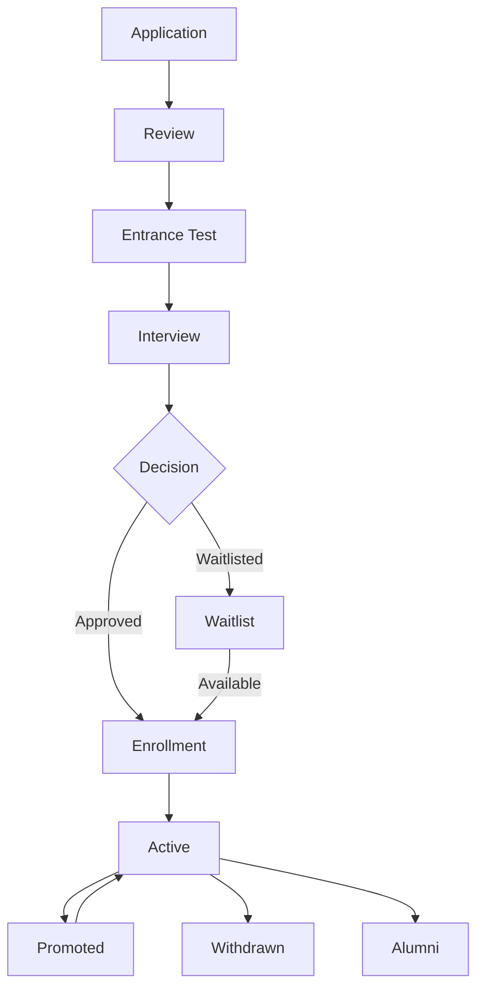
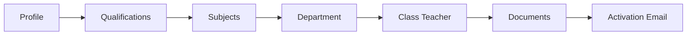
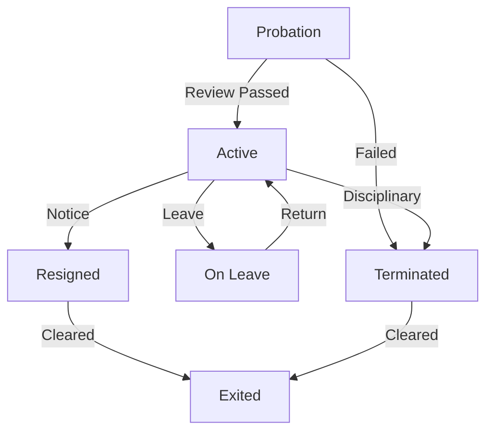

## 7. Student & Teacher Management Modules

### 7.1 Student Management Module

The Student Management Module handles the complete student lifecycle from admission through alumni conversion, providing registration workflows, profile management, class assignment, search capabilities, bulk import, and parent portal access.

#### 7.1.1 Student Registration Flow

New student registration uses a four-step wizard: **Personal Information**, **Guardian Information**, **Academic Information**, and **Document Upload**. Each step validates through Joi schemas before progression. The React frontend maintains wizard state via `useReducer`, persisting incomplete data to `localStorage` for recovery. On final submission to `POST /students`, the server generates roll numbers atomically by querying the highest existing roll for the target academic year and class-section combination, incrementing within a MongoDB transaction. Admission numbers follow the immutable format `ADM-YYYY-XXXXX`.



#### 7.1.2 Student Profile

The profile operates in dual modes: **View Mode** displays tabbed sections (Personal, Academic, Documents, Medical) with a photo gallery; **Edit Mode** activates inline editing fields on click. Deletion uses soft-delete via a `deletedAt` timestamp, preserving referential integrity with attendance and fee records.

The **Student Profile Fields** table documents the complete data model:

| Field | Category | Type | Constraints |
|---|---|---|---|
| `firstName`, `lastName` | Personal | String | Required, 2-50 chars |
| `dob` | Personal | Date | Required, grade-based age validation |
| `gender` | Personal | Enum | male, female, other |
| `bloodGroup` | Personal | Enum | A+, A-, B+, B-, AB+, AB-, O+, O- |
| `admissionNo` | Enrollment | String | Unique, immutable, ADM-YYYY-XXXXX |
| `rollNo` | Enrollment | Number | Unique per year+class+section, auto-incremented |
| `status` | Enrollment | Enum | active, inactive, transferred, withdrawn, alumni |
| `classId`, `sectionId` | Academic | ObjectId | Ref: Class, Section |
| `guardianIds` | Guardian | [ObjectId] | Max 5, Ref: Guardian |
| `allergies` | Medical | [String] | Optional |
| `deletedAt` | System | Date | Nullable, soft-delete timestamp |

Profile photo upload uses `react-cropper` for client-side cropping before server upload via Multer, which generates 300x300 and 800x800 variants stored under `uploads/students/`.

```jsx
// src/features/students/components/StudentProfile.jsx
import { useState, useEffect } from 'react';
import { useParams } from 'react-router-dom';
import { studentService } from '../services/studentService';
import { InlineEditField } from './InlineEditField';
import { StatusBadge } from '../../../components/StatusBadge';

export const StudentProfile = () => {
  const { studentId } = useParams();
  const [student, setStudent] = useState(null);
  const [isEditing, setIsEditing] = useState(false);
  const [editData, setEditData] = useState({});
  const [loading, setLoading] = useState(true);

  useEffect(() => {
    studentService.getById(studentId).then((res) => {
      setStudent(res.data);
      setEditData(res.data);
      setLoading(false);
    });
  }, [studentId]);

  const handleSave = async () => {
    const response = await studentService.update(studentId, editData);
    setStudent(response.data);
    setIsEditing(false);
  };

  const handleArchive = async () => {
    if (!window.confirm('Archive this student?')) return;
    await studentService.archive(studentId);
    setStudent((p) => ({ ...p, status: 'withdrawn', deletedAt: new Date() }));
  };

  if (loading) return <div className="skeleton">Loading...</div>;

  return (
    <div className="student-profile">
      <div className="profile-header">
        
        <div className="header-info">
          <h1><InlineEditField value={`${student.firstName} ${student.lastName}`}
                               isEditing={isEditing} /></h1>
          <p><StatusBadge status={student.status} />
             <span>Admission: {student.admissionNo}</span>
             <span>Roll: {student.rollNo}</span></p>
        </div>
        <div className="actions">
          <button onClick={() => isEditing ? handleSave() : setIsEditing(true)}>
            {isEditing ? 'Save' : 'Edit'}</button>
          <button className="btn-danger" onClick={handleArchive}>Archive</button>
        </div>
      </div>
      <div className="profile-tabs">
        <TabPanel label="Personal">
          <InlineEditField label="Blood Group" value={student.bloodGroup}
                           isEditing={isEditing} type="select" />
          <InlineEditField label="Address" value={student.address}
                           isEditing={isEditing} type="textarea" />
        </TabPanel>
        <TabPanel label="Academic">
          <p>Class: {student.classId?.name} — Section {student.sectionId?.name}</p>
        </TabPanel>
        <TabPanel label="Guardians">
          {(student.guardians || []).map((g) => (
            <div key={g._id} className="guardian-card">
              <p>{g.name} — {g.relationship}</p>
              <p>{g.phone}</p>
            </div>
          ))}
        </TabPanel>
      </div>
    </div>
  );
};
```

#### 7.1.3 Class Assignment

Assigning a student to a class-section enforces three constraints. The system validates section capacity through a count query against active students. It prevents duplicate enrollment by checking for existing active records with the same student and academic year combination, returning 409 Conflict if found. Mid-year transfers update `sectionId` while preserving `classId` and logging the change to the `StudentTransfer` collection within a MongoDB transaction.

#### 7.1.4 Student Search and Filter

The listing at `GET /students` implements server-side search with debounced input. The `q` parameter performs full-text search across name, admission number, and roll number using MongoDB's `$text` index. Filter parameters include `classId`, `sectionId`, `status`, and admission date ranges, all composing into a single query object.

```javascript
// server/src/controllers/studentController.js — Search & Pagination
const { Student } = require('../models/Student');
const { catchAsync } = require('../utils/catchAsync');

/**
 * GET /api/v1/students
 * Full-text search with server-side pagination and multi-field filtering.
 */
exports.searchStudents = catchAsync(async (req, res) => {
  const page = Math.max(parseInt(req.query.page, 10) || 1, 1);
  const limit = Math.min(parseInt(req.query.limit, 10) || 25, 100);
  const skip = (page - 1) * limit;

  const filter = { deletedAt: null };
  if (req.query.q) filter.$text = { $search: req.query.q };
  if (req.query.classId) filter.classId = req.query.classId;
  if (req.query.sectionId) filter.sectionId = req.query.sectionId;
  if (req.query.status) filter.status = req.query.status;
  if (req.query.admissionDateFrom || req.query.admissionDateTo) {
    filter.createdAt = {};
    if (req.query.admissionDateFrom) filter.createdAt.$gte = new Date(req.query.admissionDateFrom);
    if (req.query.admissionDateTo) filter.createdAt.$lte = new Date(req.query.admissionDateTo);
  }

  const [total, students] = await Promise.all([
    Student.countDocuments(filter),
    Student.find(filter)
      .populate('classId', 'name numericLevel')
      .populate('sectionId', 'name')
      .select('-__v')
      .sort({ [req.query.sortBy || 'createdAt']: req.query.sortOrder === 'asc' ? 1 : -1 })
      .skip(skip)
      .limit(limit)
      .lean()
  ]);

  res.status(200).json({
    success: true, data: students,
    meta: { page, limit, total, totalPages: Math.ceil(total / limit) }
  });
});
```

```javascript
// server/src/controllers/studentController.js — CRUD Operations
const { Student } = require('../models/Student');
const { catchAsync } = require('../utils/catchAsync');

/**
 * POST /api/v1/students
 * Creates a student with atomic roll number generation.
 */
exports.createStudent = catchAsync(async (req, res) => {
  const { classId, sectionId, academicYearId } = req.body;
  const session = await Student.startSession();
  let result;

  await session.withTransaction(async () => {
    const last = await Student.findOne({ classId, sectionId, academicYearId, deletedAt: null })
      .sort({ rollNo: -1 }).select('rollNo').session(session).lean();
    result = await Student.create(
      [{ ...req.body, rollNo: (last?.rollNo || 0) + 1 }],
      { session }
    );
  });

  await session.endSession();
  res.status(201).json({ success: true, data: result[0] });
});

/**
 * PUT /api/v1/students/:id
 * Updates student profile with validation.
 */
exports.updateStudent = catchAsync(async (req, res) => {
  const student = await Student.findByIdAndUpdate(
    req.params.id,
    { $set: req.body },
    { new: true, runValidators: true }
  );
  if (!student) {
    return res.status(404).json({ success: false, message: 'Not found' });
  }
  res.status(200).json({ success: true, data: student });
});

/**
 * DELETE /api/v1/students/:id
 * Soft-deletes a student record.
 */
exports.deleteStudent = catchAsync(async (req, res) => {
  const student = await Student.findByIdAndUpdate(
    req.params.id,
    { $set: { status: 'withdrawn', deletedAt: new Date() } },
    { new: true }
  );
  if (!student) {
    return res.status(404).json({ success: false, message: 'Not found' });
  }
  res.status(204).send();
});
```

#### 7.1.5 Bulk Import

Bulk import follows a parse-upload-validate-commit pattern. Administrators download a CSV template, upload via `POST /students/bulk-import`, and the server parses using `csv-parser`. Each row validates against the Joi student schema; the response contains a preview with valid rows, error rows with field-level messages, and a summary. Committing inserts validated rows within a transaction and returns a success/failure report.

#### 7.1.6 Student Dashboard

The student dashboard displays an academic summary card, attendance percentage ring for the current month, fee due status with color coding (green/amber/red), upcoming exams within 14 days, and recent marks. Students download their ID card as a PDF generated via Puppeteer with school branding, photo, and barcode.

#### 7.1.7 Parent Portal

Parents access a view-only portal linked to students via `guardianIds`. After login, parents select a child from linked students and view profile, attendance calendar, marks, and fee statements. The messaging interface creates threaded conversations stored in the `Message` collection. All portal endpoints enforce middleware restricting access to `parent` role and validating the requested `studentId` exists in the parent's linked array.

### 7.2 Teacher Management Module

#### 7.2.1 Teacher Onboarding

Onboarding extends base staff registration with qualification entry, subject specialization selection, department assignment, and class teacher designation. The system generates an `EMP-YYYY-XXXXX` employee ID and a `teacher` role User account. An activation email with a 24-hour JWT link dispatches via Nodemailer.



#### 7.2.2 Teacher Profile

The profile renders a qualifications timeline, experience history, assigned classes and subjects grid, personal timetable view, and contract details with renewal alerts at 30, 15, and 7 days before expiry. The `isTeachingStaff` boolean distinguishes teaching from non-teaching roles.

#### 7.2.3 Department Management

Departments (Science, Mathematics, Languages, Arts, Administration) include `name`, `code`, `description`, and `headId` referencing the department head. The head gains elevated permissions for lesson plan review and staff attendance monitoring. CRUD operations require `admin` or `principal` roles; deletion mandates reassignment or soft-delete archival.

#### 7.2.4 Teacher-Class-Subject Assignment Matrix

The assignment matrix provides a visual grid for teacher allocations. The `GET /teachers/assignment-matrix` endpoint aggregates timetable entries by teacher and class-section.

The **Teacher Assignment Matrix** illustrates the structure:

| Teacher | 8-A | 8-B | 9-A | 9-B | 10-A | Weekly Total |
|---|---|---|---|---|---|---|
| R. Sharma (Math) | Math (6) | Math (6) | — | — | Math (6) | 18 |
| P. Gupta (Sci) | Sci (6) | — | Sci (6) | Sci (6) | — | 18 |
| S. Patel (Eng) | — | Eng (6) | Eng (6) | — | Eng (6) | 18 |
| A. Khan (Hindi) | Hindi (5) | Hindi (5) | — | Hindi (5) | — | 15 |
| M. Joshi (SST) | — | SST (5) | SST (5) | — | SST (5) | 15 |

```javascript
// server/src/controllers/teacherController.js
const { TimetableEntry } = require('../models/TimetableEntry');
const { catchAsync } = require('../utils/catchAsync');

exports.getAssignmentMatrix = catchAsync(async (req, res) => {
  const { academicYearId } = req.query;
  const matchStage = { academicYearId, deletedAt: null };

  const matrix = await TimetableEntry.aggregate([
    { $match: matchStage },
    {
      $group: {
        _id: { teacherId: '$teacherId', classId: '$classId', sectionId: '$sectionId' },
        subjects: { $addToSet: '$subjectId' },
        periodCount: { $sum: 1 }
      }
    },
    {
      $lookup: { from: 'teachers', localField: '_id.teacherId',
                 foreignField: '_id', as: 'teacher' }
    },
    { $unwind: '$teacher' },
    {
      $lookup: { from: 'subjects', localField: 'subjects',
                 foreignField: '_id', as: 'subjectDetails' }
    },
    {
      $group: {
        _id: '$_id.teacherId',
        teacherName: { $first: { $concat: ['$teacher.firstName', ' ', '$teacher.lastName'] } },
        assignments: {
          $push: { classId: '$_id.classId', sectionId: '$_id.sectionId',
                   subjects: '$subjectDetails.name', periods: '$periodCount' }
        },
        totalPeriods: { $sum: '$periodCount' }
      }
    },
    { $sort: { teacherName: 1 } }
  ]);

  // Detect double-booking conflicts
  const conflicts = await TimetableEntry.aggregate([
    { $match: matchStage },
    {
      $group: {
        _id: { teacherId: '$teacherId', dayOfWeek: '$dayOfWeek', periodNo: '$periodNo' },
        count: { $sum: 1 }
      }
    },
    { $match: { count: { $gt: 1 } } }
  ]);

  res.status(200).json({
    success: true, data: matrix,
    meta: { conflictCount: conflicts.length }
  });
});
```

#### 7.2.5 Workload Calculation

The workload engine aggregates periods per teacher per week from Timetable entries. Each teacher stores `minPeriods` and `maxPeriods` constraints (default 20 and 40). Recalculation triggers on timetable changes, with alerts for underutilization (below minimum) or overload (above maximum). Analytics endpoints return standard deviation across departments to identify distribution imbalance.

### 7.3 Staff Management Module

#### 7.3.1 Staff Categories

Non-teaching staff occupy three categories: **Administrative** (reception, clerk), **Support** (peons, security), and **Specialized** (librarian, accountant, transport manager). Employment types are `permanent`, `contract`, and `probation` (default 6 months with mandatory review 7 days before expiry).

#### 7.3.2 Staff Registration

Non-teaching registration uses a simplified single-page form collecting personal details, designation, and role assignment. The system generates an ID card with a barcode and prints a credentials sheet. Role assignments create entries in the `UserRole` junction table mapping operational permissions.

#### 7.3.3 Employment Lifecycle

Status transitions follow a state machine: **probation** to **active** requires principal approval; **active** to **on-leave** for approved leave; **active** to **resigned** on notice submission; **active** to **terminated** for disciplinary action with administrative authorization. Exit triggers a clearance checklist: library (no outstanding books), accounting (no dues), and IT (equipment returned).



### 7.4 User Directory & Search

#### 7.4.1 Unified Directory

The User Directory at `/directory` consolidates students, teachers, and staff through MongoDB's `$unionWith` aggregation, projecting each entity to a common shape with `name`, `role`, `status`, and avatar. Role badges render as color-coded pills. Quick actions (view, edit, message, deactivate) appear conditionally based on viewer permissions.

#### 7.4.2 Advanced Filters

The filter panel supports combined queries: a `$text` search on name fields, plus dropdowns for class, department, status, and employment type. Filter selections serialize to URL parameters for bookmarkable views. Users save presets in `UserPreference` for quick recall.

#### 7.4.3 Profile Export

Individual export generates a PDF via Puppeteer from an HTML template with photo and school branding. Bulk export uses the `xlsx` library for Excel generation. Print-friendly views apply `@media print` CSS that hides navigation and ensures 300 DPI photo quality.
