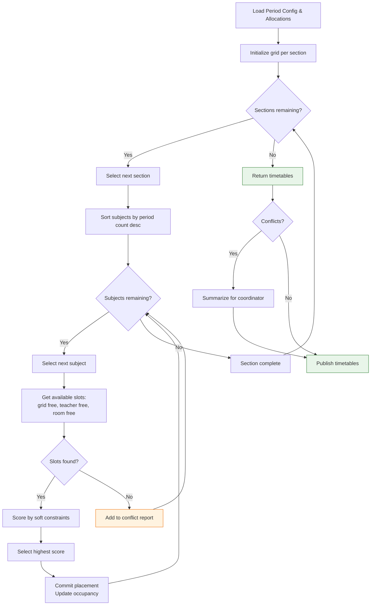
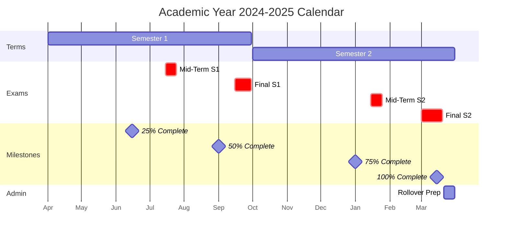

## 8. Academic Management

Academic Management defines the structural backbone of the School Management System, establishing the organizational framework within which all educational activities operate. This module spans five interconnected subsystems: academic year lifecycle management, class and section hierarchy maintenance, subject catalog administration, constraint-based timetable generation, and curriculum progress tracking.

### 8.1 Academic Year & Session Management

The **academic year** is the top-level temporal container for all school data. Each record defines a named session (for example, "2024-2025") with start and end dates, a term structure, and promotion criteria. A pre-save validation hook queries existing documents and rejects any record whose date range intersects with an active session — overlap prevention is critical because student enrollments, fee structures, timetables, and attendance records all carry a foreign key to a single academic year.

The **term structure** supports semester (two terms) or trimester (three terms) configurations. Each term sub-document stores its own start and end dates and an examination session reference. The system validates that the union of all term date ranges exactly covers the parent academic year span with no gaps. Promotion criteria attach at the academic year level: minimum aggregate percentage, maximum permitted failing subjects, and minimum attendance percentage.

**Session rollover** executes as a multi-step transactional workflow. Step one archives the outgoing year by setting `isCurrent` to `false` and creating aggregate snapshots into an `AcademicYearArchive` collection. Step two promotes students based on configured criteria (see section 8.1.3). Step three generates the new academic year, rolls forward fee structures with optional increments, and seeds empty timetable shells. The entire workflow runs inside a MongoDB transaction; failure at any step triggers full rollback with an error report to the administrator.

**Student progression** evaluates each active student against three criteria: aggregate marks meet the minimum, failed subjects do not exceed the maximum (typically two), and attendance meets the threshold. Students satisfying all criteria receive `promoted` status. Students failing one or two subjects receive `conditional` status with mandatory remedial assignments. Students exceeding the failure limit receive `detained` status and remain in their current class. The engine detects class capacity overflow after promotion — when target enrollment would exceed total section capacity — and alerts administrators to create additional sections before finalizing the rollover.

### 8.2 Class & Section Management

#### 8.2.1 Class Hierarchy and Section Capacity

The class hierarchy spans Nursery through Grade 12. Each **Class** document carries a display name ("Grade 9"), numeric sort order, affiliated board, and active status. **Sections** exist as embedded sub-documents with a name ("A", "B", "C"), capacity (default 40), room number, and `classTeacherId` reference. Embedding sections within the parent class optimizes read performance since sections are almost always queried in the context of their class. When a section reaches capacity, subsequent allocations place students on a **waitlist** ordered by timestamp; available seats are automatically offered to the longest-waiting student.

#### 8.2.2 Section CRUD API

The section management API enforces capacity constraints and teacher assignment integrity. The following controller implements core endpoints:

```javascript
// server/controllers/classController.js
const Class = require('../models/Class');
const AppError = require('../utils/AppError');

/** Add a section to an existing class with uniqueness and capacity validation. */
exports.addSection = async (req, res, next) => {
  const { classId } = req.params;
  const { sectionName, capacity, roomNumber, classTeacherId } = req.body;

  const classDoc = await Class.findById(classId);
  if (!classDoc) return next(new AppError('Class not found', 404));

  if (classDoc.sections.some(s => s.name.toUpperCase() === sectionName.toUpperCase())) {
    return next(new AppError(`Section ${sectionName} already exists`, 409));
  }

  // Prevent duplicate class teacher assignment across sections in same year
  if (classTeacherId) {
    const conflict = await Class.findOne({
      'sections.classTeacherId': classTeacherId,
      academicYearId: classDoc.academicYearId,
      _id: { $ne: classId }
    });
    if (conflict) return next(new AppError('Teacher already assigned to another section', 409));
  }

  classDoc.sections.push({
    name: sectionName.toUpperCase(), capacity: capacity || 40,
    roomNumber, classTeacherId, studentList: [], waitlist: []
  });
  await classDoc.save();
  res.status(201).json({ success: true, data: classDoc });
};

/** Update section metadata. Prevents capacity reduction below current enrollment. */
exports.updateSection = async (req, res, next) => {
  const { classId, sectionId } = req.params;
  const updates = req.body;

  const classDoc = await Class.findById(classId);
  const section = classDoc?.sections.id(sectionId);
  if (!section) return next(new AppError('Section not found', 404));

  if (updates.capacity && updates.capacity < section.studentList.length) {
    return next(new AppError(`Capacity below enrollment (${section.studentList.length})`, 400));
  }
  Object.keys(updates).forEach(k => { if (section[k] !== undefined) section[k] = updates[k]; });
  await classDoc.save();
  res.status(200).json({ success: true, data: section });
};

/** Soft-delete a section only if enrollment is zero. */
exports.deleteSection = async (req, res, next) => {
  const { classId, sectionId } = req.params;
  const classDoc = await Class.findById(classId);
  const section = classDoc?.sections.id(sectionId);
  if (!section) return next(new AppError('Section not found', 404));
  if (section.studentList.length > 0) {
    return next(new AppError('Cannot delete section with enrolled students', 409));
  }
  section.status = 'inactive';
  await classDoc.save();
  res.status(204).send();
};
```

#### 8.2.3 Student Allocation and Class Teacher Assignment

Student-to-section allocation verifies target capacity before updating the student's `sectionId` reference. Mid-year re-allocation logs timestamp and reason into an `AllocationHistory` collection. Each section has exactly one **primary class teacher**; co-teacher support is implemented through a separate `coTeachers` array. Teacher change workflow creates a pending `TeacherChangeRequest` requiring principal approval, with full audit trail including effective date archiving.

### 8.3 Subject Management

#### 8.3.1 Subject Catalog

The **Subject** collection stores the master catalog with fields: unique code (`MATH-101`), name, type enum (**core**, **elective**, **co-curricular**), credits, passing marks, and `applicableClasses` array. Unique code enforcement uses a MongoDB unique index. Soft delete sets status to `inactive`; a pre-change hook queries `ClassSubject` for active allocations and rejects deletion if references exist.

#### 8.3.2 Class-Wise Subject Allocation

The `ClassSubject` collection links subjects to class-section combinations for an academic year, storing the primary teacher, periods per week, and exam applicability. The matrix below illustrates a Grade 9 allocation:

| Subject Code | Subject Name | Type | Periods/Week | Exam | Teacher |
|---|---|---|---|---|---|
| MATH-09 | Mathematics | Core | 6 | Yes | T. Sharma |
| SCI-09 | Science | Core | 6 | Yes | R. Gupta |
| ENG-09 | English | Core | 6 | Yes | P. Verma |
| SST-09 | Social Studies | Core | 5 | Yes | K. Reddy |
| HIN-09 | Hindi | Core | 4 | Yes | S. Patel |
| CMP-09 | Computer Science | Elective | 4 | Yes | A. Khan |
| ART-09 | Fine Arts | Elective | 3 | Yes | M. Joshi |
| PED-09 | Physical Education | Co-curricular | 3 | No | R. Singh |

Each row generates one `ClassSubject` document per section. The periods-per-week value feeds into timetable generation as a hard constraint — the algorithm must schedule exactly the specified number of periods. Core subjects automatically carry the exam flag; co-curricular subjects typically do not.

#### 8.3.3 Elective Selection

Elective allocation follows a two-phase process. In phase one, the coordinator publishes options with a submission deadline; students submit ranked preferences. In phase two, the system allocates using either first-come-first-serve or preference-based assignment. Each elective has minimum and maximum enrollment thresholds; if minimum is not met, the elective is cancelled and affected students are reassigned. The coordinator locks selections upon finalization, generating `ClassSubject` records that feed into timetable generation.

### 8.4 Timetable Management

#### 8.4.1 Period Configuration

The timetable system begins with period configuration — a daily schedule template defining period duration (45 minutes), periods per day (8), break slots, working days (Mon-Sat), and assembly time. The table below shows a typical weekly structure:

| Day | P1 | P2 | P3 | Break | P4 | P5 | Lunch | P6 | P7 | P8 |
|---|---|---|---|---|---|---|---|---|---|---|
| Mon-Fri | 08:00 | 08:45 | 09:30 | 10:15-10:30 | 10:30 | 11:15 | 12:00-12:45 | 12:45 | 13:30 | 14:15 |
| Sat | 08:00 | 08:45 | 09:30 | 10:15-10:30 | 10:30 | 11:15 | — | — | — | — |

Saturday runs a shortened schedule. Period configuration stores as a document linked to the academic year; multiple configurations can exist with effective date ranges. The generation algorithm reads the active configuration to determine available slots.

#### 8.4.2 Timetable Generation Algorithm

The generation engine implements a **constraint-satisfaction algorithm** with backtracking. It processes each class-section independently, placing subject periods into available slots while satisfying hard constraints: no teacher double-booked, no room double-booked, exact period requirements met, and no consecutive same-subject periods (soft constraint). The algorithm sorts subjects by period count descending — high-requirement subjects have fewer valid combinations and cause conflicts if deferred. For each subject, it queries available slots, ranks them by a scoring function, commits the highest-scoring valid placement, and updates global occupancy trackers.



The core generation service implements this logic:

```javascript
// server/services/timetableGenerator.js
const ClassSubject = require('../models/ClassSubject');
const TimetableEntry = require('../models/TimetableEntry');

/**
 * Generates timetable entries for all class-sections using constraint-satisfaction.
 * @param {string} academicYearId - Target academic year
 * @param {Object} periodConfig - Period configuration document
 * @returns {Promise<{entries: Array, conflicts: Array}>}
 */
exports.generateTimetable = async (academicYearId, periodConfig) => {
  const allocations = await ClassSubject.find({ academicYearId })
    .populate('subjectId teacherId');

  // Group by class-section
  const sectionMap = new Map();
  for (const a of allocations) {
    const key = `${a.classId}#${a.sectionId}`;
    if (!sectionMap.has(key)) sectionMap.set(key, []);
    sectionMap.get(key).push(a);
  }

  const entries = [];
  const conflicts = [];
  const teacherOcc = new Set(); // "teacherId@day#period"
  const roomOcc = new Set();    // "roomId@day#period"

  for (const [key, allocs] of sectionMap) {
    const [classId, sectionId] = key.split('#');
    allocs.sort((a, b) => b.periodsPerWeek - a.periodsPerWeek);

    const grid = new Map(); // dayIdx -> Set of occupied period numbers
    for (let d = 0; d < periodConfig.workingDays.length; d++) grid.set(d, new Set());

    for (const alloc of allocs) {
      let placed = 0;
      const needed = alloc.periodsPerWeek;
      const candidates = [];

      for (let d = 0; d < periodConfig.workingDays.length; d++) {
        for (let p = 1; p <= periodConfig.periodsPerDay; p++) {
          if (periodConfig.isBreakPeriod(p)) continue;
          const slotKey = `${d}#${p}`;
          if (grid.get(d).has(p)) continue;
          if (teacherOcc.has(`${alloc.teacherId._id}@${slotKey}`)) continue;
          if (roomOcc.has(`${alloc.roomId || 'DEF'}@${slotKey}`)) continue;

          let score = 0;
          if (!grid.get(d).has(p - 1)) score += 10; // avoid consecutive
          score -= grid.get(d).size * 2;             // spread across days
          candidates.push({ d, p, score });
        }
      }

      candidates.sort((a, b) => b.score - a.score);
      for (const c of candidates) {
        if (placed >= needed) break;
        const sk = `${c.d}#${c.p}`;
        grid.get(c.d).add(c.p);
        teacherOcc.add(`${alloc.teacherId._id}@${sk}`);
        roomOcc.add(`${alloc.roomId || 'DEF'}@${sk}`);
        entries.push({
          academicYearId, classId, sectionId,
          dayOfWeek: periodConfig.workingDays[c.d], periodNo: c.p,
          subjectId: alloc.subjectId._id, teacherId: alloc.teacherId._id,
          roomId: alloc.roomId
        });
        placed++;
      }

      if (placed < needed) {
        conflicts.push({ classId, sectionId, subject: alloc.subjectId.name,
          needed, placed });
      }
    }
  }
  await TimetableEntry.insertMany(entries, { ordered: false });
  return { entries, conflicts };
};
```

#### 8.4.3 Conflict Detection and Timetable Views

The manual editor provides real-time conflict detection: every proposed change queries teacher and room occupancy, with valid placements highlighting in green and violations in red. A teacher availability sidebar displays free periods, simplifying substitute identification. The system renders timetables through three view modes: class-wise (all sections side-by-side), teacher-wise (personal schedule), and room-wise (per-classroom schedule).

The `TimetableGrid` component implements the class-wise view:

```jsx
// client/src/features/academics/components/TimetableGrid.jsx
import React, { useMemo } from 'react';

/**
 * Renders a class-wise weekly timetable grid.
 * Rows = periods, Columns = working days.
 * @param {Object[]} entries - TimetableEntry documents
 * @param {string[]} workingDays - Ordered day names
 * @param {number} periodsPerDay - Total periods per day
 * @param {boolean} isEditable - Whether cells are clickable
 * @param {Function} onCellClick - Callback(dayOfWeek, periodNo, entry)
 */
const TimetableGrid = ({ entries, workingDays, periodsPerDay, isEditable, onCellClick }) => {
  const entryMap = useMemo(() => {
    const map = new Map();
    for (const e of entries) map.set(`${e.dayOfWeek}#${e.periodNo}`, e);
    return map;
  }, [entries]);

  const breakPeriods = [4];
  const lunchPeriod = 7;

  const getCell = (day, p) => {
    const entry = entryMap.get(`${day}#${p}`);
    if (!entry) return <span className="text-gray-400">—</span>;
    return (
      <div className="flex flex-col items-center">
        <span className="font-semibold text-indigo-700 text-xs">
          {entry.subjectId.shortName}
        </span>
        <span className="text-gray-500 text-xs">{entry.teacherId?.abbreviation}</span>
        {entry.roomId && <span className="text-gray-400 text-xs">{entry.roomId}</span>}
      </div>
    );
  };

  return (
    <div className="overflow-x-auto rounded-lg border border-gray-200">
      <table className="w-full border-collapse min-w-[600px]">
        <thead>
          <tr className="bg-gray-50">
            <th className="border px-3 py-2 text-xs font-semibold w-20">Period</th>
            {workingDays.map(d => (
              <th key={d} className="border px-3 py-2 text-xs font-semibold">{d}</th>
            ))}
          </tr>
        </thead>
        <tbody>
          {Array.from({ length: periodsPerDay }, (_, i) => i + 1).map(p => (
            <tr key={p} className="hover:bg-gray-50">
              <td className="border px-2 py-2 text-center text-xs font-medium">P{p}</td>
              {breakPeriods.includes(p) ? (
                <td colSpan={workingDays.length} className="border bg-amber-50 text-center py-1">
                  <span className="text-xs text-amber-700">Break</span>
                </td>
              ) : p === lunchPeriod ? (
                <td colSpan={workingDays.length} className="border bg-green-50 text-center py-1">
                  <span className="text-xs text-green-700">Lunch</span>
                </td>
              ) : workingDays.map(d => (
                <td key={`${d}-${p}`} className={`border h-16 w-32 ${
                  isEditable ? 'cursor-pointer hover:bg-indigo-50' : ''
                }`} onClick={() => isEditable && onCellClick?.(d, p, entryMap.get(`${d}#${p}`))}>
                  {getCell(d, p)}
                </td>
              ))}
            </tr>
          ))}
        </tbody>
      </table>
    </div>
  );
};

export default TimetableGrid;
```

#### 8.4.4 Substitution Management

When a teacher is absent, the system identifies affected timetable entries and queries the teacher occupancy tracker for available substitutes — teachers with a free period in the same slot who teach the same subject elsewhere. The coordinator selects a substitute from ranked suggestions; the system creates a `Substitution` record and notifies the substitute via push and email. All substitutions log to a history collection for payroll adjustment and tracking.

### 8.5 Curriculum & Syllabus Tracking

#### 8.5.1 Syllabus Upload and Lesson Planning

The syllabus subsystem stores chapter-wise topic listings per subject-class combination. Each syllabus contains **units**, and each unit contains **topics** with estimated period requirements, learning outcomes, and optional document attachments. The system implements **version control**: modifying an approved syllabus creates a new version rather than overwriting, preserving existing lesson plan references.

**Lesson plans** link directly to syllabus topics. Teachers create plans specifying objectives, methodology, resources, assessment method, and homework. Plans carry status: `draft`, `submitted`, `reviewed`, or `completed`. Department heads review submitted plans and approve or return with feedback.

#### 8.5.2 Progress Tracking

Progress tracking aggregates topic completion to compute a **curriculum completion percentage** per subject. The dashboard displays visual progress bars with **overdue topic alerts** when the current date exceeds a topic's planned completion date and the topic remains incomplete. The administration receives a term-end completion report showing per-subject percentages, remaining topics, and variance from plan.

The academic year calendar below illustrates how terms, examinations, and curriculum milestones align:



Semester 1 spans April through September, Semester 2 from October through March. Examination windows at the 50% and 100% milestones interrupt instruction. Curriculum completion checkpoints trigger automated alerts if actual progress lags behind the plan. The session rollover preparation period at the end of March executes archival, promotion, and new-year setup to ensure the next academic year commences without data continuity gaps.
