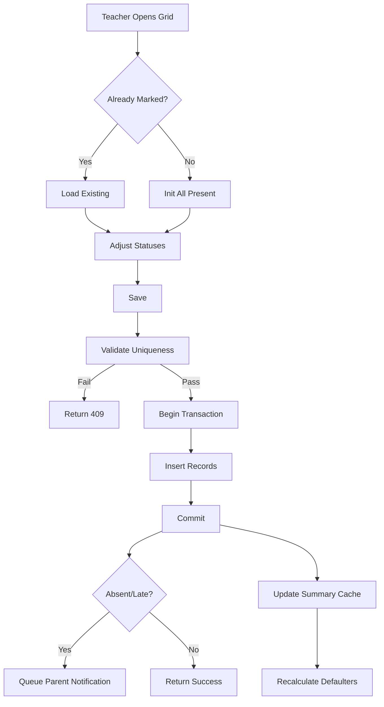
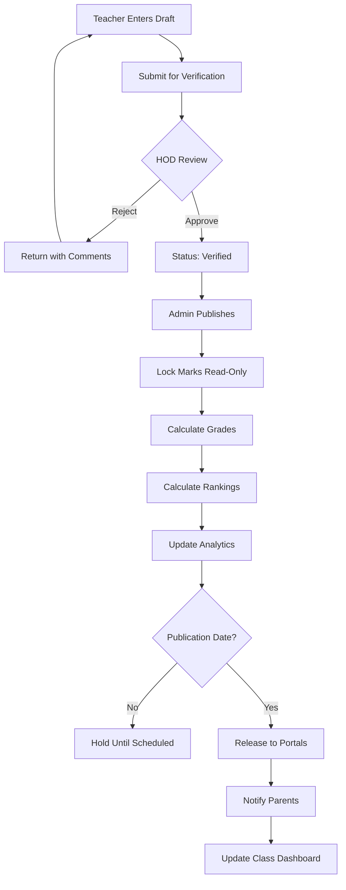

## 9. Attendance & Examination System

### 9.1 Attendance Management

#### 9.1.1 Marking Interface

The daily attendance interface renders a grid with students as rows and attendance statuses as columns. Each cell is a single-click toggle cycling through available statuses. Class teachers view all students in their assigned section and mark attendance for the current or any selected working day. Subject-wise attendance allows subject teachers to mark presence for specific periods independently. A "Mark All Present" button toggles every student to **Present**, after which the teacher adjusts individual exceptions.

#### 9.1.2 Attendance Bulk Mark API

The `POST /attendance/bulk-mark` endpoint accepts an array of attendance records and performs an atomic insert within a MongoDB transaction. It validates that no attendance records exist for the same class-section-date combination before insertion, preventing double-marking.

```javascript
// server/controllers/attendanceController.js
const markBulkAttendance = catchAsync(async (req, res) => {
  const { classId, sectionId, date, subjectId, records } = req.body;
  const session = await mongoose.startSession();

  try {
    await session.withTransaction(async () => {
      const existingQuery = { classId, sectionId, date: new Date(date) };
      if (subjectId) existingQuery.subjectId = subjectId;

      const existing = await Attendance.countDocuments(existingQuery, { session });
      if (existing > 0) {
        throw new AppError('Attendance already marked for this date', 409);
      }

      const docs = records.map((rec) => ({
        studentId: rec.studentId,
        classId,
        sectionId,
        subjectId: subjectId || null,
        date: new Date(date),
        status: rec.status,
        markedBy: req.user._id,
        remarks: rec.remarks || '',
      }));

      await Attendance.insertMany(docs, { session, ordered: true });
    });

    notifyParentsOfAbsence(records, date);
    res.status(201).json({
      success: true,
      message: `Marked attendance for ${records.length} students`,
    });
  } finally {
    await session.endSession();
  }
});
```

#### 9.1.3 Status Definitions

The system supports six attendance statuses, each with a single-character code and defined percentage contribution rules.

| Status | Code | Description | Pct. Contribution | Trigger |
|---|---|---|---|---|
| **Present** | `P` | Full session attendance | 1.0 day | Default; teacher marks or bulk |
| **Absent** | `A` | No attendance | 0.0 day | Teacher marks; triggers parent notification |
| **Late** | `L` | Arrived after threshold (default 10:00 AM) | 1.0 day | Check-in time or teacher override |
| **Half-Day** | `H` | Attended morning or afternoon only | 0.5 day | Teacher marks; biometric partial |
| **Excused** | `E` | Approved leave; equivalent to present | 1.0 day | Auto-set on leave approval |
| **On-Duty** | `O` | School-sanctioned external activity | 1.0 day | Admin marks with reason |

A **Late** threshold is stored per academic year in `lateThresholdMinutes`. Three late marks within 30 days generate a disciplinary alert. The **Excused** status bridges the leave workflow (Section 9.1.7) with attendance records: approved leave requests automatically create `Excused` entries for each date in the range.

#### 9.1.4 Attendance Analytics

Monthly attendance percentage uses the formula: `(Present + Half-Day/2 + Excused + On-Duty) / Working Days * 100`. The default minimum threshold is 75%, configurable per academic year. Students below this appear on the defaulter list reviewed weekly by class teachers. Class-wise daily summaries show present, absent, and percentage metrics. Alerts propagate via in-app notifications to teachers and principals, plus automated SMS/email to parents when attendance drops below 75% for two consecutive weeks.

#### 9.1.5 Monthly Report

The monthly report renders a calendar grid with daily status codes colored by type. Summary statistics aggregate present, absent, late, half-day, and excused counts. PDF export via `puppeteer` renders an HTML template with school header, student details, calendar grid, summary table, and signature blocks for class teacher and principal. A parent copy omits internal remarks and reduces to a single-page summary.

#### 9.1.6 Parent Notification

The notification service triggers on every `Absent` or `Late` marking with a configurable delay (default 30 minutes) to prevent redundant alerts from teacher corrections. The queue stores delivery status (`queued`, `sent`, `delivered`, `failed`) with exponential backoff retry for transient SMS failures. Parents receive the student name, date, status, and a link to the attendance detail view.

#### 9.1.7 Leave Application

Students or parents submit leave requests specifying a date range, type (medical, family, sports, other), and reason. Supporting documents upload via Multer. The workflow routes to the class teacher for approval; on approval, the system iterates each date and creates an `Excused` attendance record if no conflict exists. Rejection requires a reason logged in the application history.



### 9.2 Examination Management

#### 9.2.1 Exam Types

Six configurable exam types feed into final grade calculation: **Unit Test** (monthly, 10% weightage), **Mid-Term** (25%), **Final Exam** (50%), **Quiz** (5%), **Practical** and **Oral** (configured per subject). The system validates that weightages sum to 100% per subject. Each exam type defines whether it is graded, supports practical components, and the default maximum marks.

#### 9.2.2 Exam Schedule

Creating an exam defines a date range, then adds subject-wise schedule entries with date, time, and maximum marks. The schedule publishes to student and parent portals upon confirmation, triggering notifications. Hall ticket generation (Section 9.2.4) queries this schedule to produce per-student admit cards.

#### 9.2.3 Exam Timetable

The calendar view aggregates all scheduled exams, filterable by class and section. Clash detection flags any class-section with two exams on the same date. Seating arrangement generation uses round-robin distribution across rooms, ensuring adjacent seats hold students from different sections.

#### 9.2.4 Hall Ticket

The hall ticket auto-generates per student before the exam period, including the student photograph, scheduled subjects with dates and times, examination rules, and a verification barcode encoding the admission number. PDF generation uses `puppeteer` with the school header and principal signature block.

### 9.3 Marks Entry & Processing

#### 9.3.1 Marks Entry Interface

The teacher's portal loads students for the teacher's assigned subjects and selected exam. A grid displays input fields for theory marks, practical marks (if applicable), and remark codes. Each input enforces range validation (0 to `maxMarks`) on blur. Auto-save draft mode persists to `localStorage` every 10 seconds. The teacher toggles between **Draft** and **Submit for Verification**; once submitted, marks become read-only for the teacher.

#### 9.3.2 Validation Rules

Four hard constraints govern every entry: range validation (`0 <= marks <= maxMarks`); duplicate prevention via a compound unique index on `(studentId, examScheduleId)` returning 409 on conflict; grace marks requiring admin configuration with maximums per subject and per student, applied only by admins with audit logging; and remark codes (`ABS`, `CNG`, `UMC`, `CAN`) that override numeric marks and display on report cards in place of grades.

#### 9.3.3 Marks Workflow

Marks follow a four-state pipeline: **Draft** → **Submitted** → **Verified** → **Published**. Teachers create and edit drafts freely, then submit for verification. Department heads review and either verify or return with comments. Admins publish, locking records and triggering grade calculation.

```javascript
// server/controllers/marksController.js
const marksController = {
  saveDraft: catchAsync(async (req, res) => {
    const { examScheduleId, marks } = req.body;
    const teacherId = req.user._id;

    const schedule = await ExamSchedule.findById(examScheduleId);
    if (!schedule) throw new AppError('Exam schedule not found', 404);

    const ops = marks.map((m) => ({
      updateOne: {
        filter: { studentId: m.studentId, examScheduleId },
        update: {
          $set: {
            marksObtained: m.marksObtained,
            marksObtainedPractical: m.marksObtainedPractical || 0,
            remarkCode: m.remarkCode || null,
            status: 'draft',
            enteredBy: teacherId,
            enteredAt: new Date(),
          },
        },
        upsert: true,
      },
    }));

    await Marks.bulkWrite(ops);
    res.status(200).json({ success: true, message: 'Draft saved' });
  }),

  submitForVerification: catchAsync(async (req, res) => {
    const { examScheduleId } = req.body;
    const result = await Marks.updateMany(
      { examScheduleId, status: 'draft' },
      { $set: { status: 'submitted', submittedAt: new Date() } }
    );
    res.status(200).json({
      success: true,
      message: `${result.modifiedCount} marks submitted`,
    });
  }),

  publishResults: catchAsync(async (req, res) => {
    if (req.user.role !== 'admin') {
      throw new AppError('Only admin can publish', 403);
    }
    const { examScheduleId } = req.body;
    const session = await mongoose.startSession();
    await session.withTransaction(async () => {
      await Marks.updateMany(
        { examScheduleId, status: 'verified' },
        { $set: { status: 'published', publishedAt: new Date() } },
        { session }
      );
      await calculateGradesForExam(examScheduleId, session);
    });
    await session.endSession();
    res.status(200).json({ success: true, message: 'Results published' });
  }),
};
```

#### 9.3.4 Lock Mechanism

Published marks are immutable. The `pre('save')` hook on the Marks model rejects modifications where `status === 'published'`. Correction requires an admin-initiated unlock with reason audit; previous values append to a `versionHistory` array, preserving full traceability.

### 9.4 Grading System

#### 9.4.1 Grade Scale

The configurable grade scale maps percentage ranges to letter grades. The default 7-point scale:

| Grade | Range | Grade Point | Description | Pass/Fail |
|---|---|---|---|---|
| **A+** | 90 – 100 | 10 | Outstanding | Pass |
| **A** | 80 – 89 | 9 | Excellent | Pass |
| **B+** | 70 – 79 | 8 | Very Good | Pass |
| **B** | 60 – 69 | 7 | Good | Pass |
| **C** | 50 – 59 | 6 | Satisfactory | Pass |
| **D** | 40 – 49 | 5 | Minimum Pass | Pass |
| **F** | Below 40 | 0 | Fail | Fail |

Each academic year maintains its own grade scale version, ensuring historical report cards use the scale in effect at the time. The `isPassing` boolean determines promotion eligibility.

#### 9.4.2 Grade Calculation

The engine aggregates weighted marks across exam types per subject, computes percentages, assigns grades, and calculates ranks. Overall percentage is the simple average of subject percentages. Rank sorts students within class-section by overall percentage; ties break by total marks. Division assignment: **First** (>=60%), **Second** (50-59%), **Third** (40-49%), **Fail** (<40%).

```javascript
// server/services/gradeCalculationService.js
const calculateStudentGrades = async (studentId, academicYearId, session) => {
  const marks = await Marks.find({ studentId, status: 'published' })
    .populate({
      path: 'examScheduleId',
      populate: [{ path: 'subjectId' }, { path: 'examId', populate: 'examTypeId' }],
    })
    .session(session);

  const bySubject = {};
  for (const m of marks) {
    const sid = m.examScheduleId.subjectId._id.toString();
    if (!bySubject[sid]) {
      bySubject[sid] = { weightedMarks: 0, weightedMax: 0 };
    }
    const w = m.examScheduleId.examId.examTypeId.weightage / 100;
    bySubject[sid].weightedMarks += m.marksObtained * w;
    bySubject[sid].weightedMax += m.examScheduleId.maxMarks * w;
  }

  const scale = await GradeScale.find({ academicYearId }).sort('minMarks').session(session);
  let totalPct = 0;
  const results = Object.entries(bySubject).map(([, d]) => {
    const pct = (d.weightedMarks / d.weightedMax) * 100;
    totalPct += pct;
    const g = scale.find((s) => pct >= s.minMarks && pct <= s.maxMarks);
    return { percentage: +pct.toFixed(2), grade: g?.grade || 'F', isPassing: g?.isPassing ?? false };
  });

  const overall = totalPct / results.length;
  const og = scale.find((s) => overall >= s.minMarks && overall <= s.maxMarks);
  return {
    subjectResults: results,
    overallPercentage: +overall.toFixed(2),
    overallGrade: og?.grade || 'F',
    allPassing: results.every((r) => r.isPassing),
    distinction: overall >= 75 && results.every((r) => r.isPassing),
  };
};
```

#### 9.4.3 Result Processing

Result processing executes after all subject marks are published. The pipeline computes subject-wise marks and grades, aggregates overall totals, assigns grades and ranks, and determines pass/fail (all subjects must have passing grades; more than two failures means ineligible for promotion). The **distinction** flag requires 75% or higher overall with no failures. Results write to `StudentPerformanceAnalytics` for fast dashboard querying.

#### 9.4.4 Report Card Generation

The report card controller renders a PDF via `puppeteer` with student details, subject-wise results, attendance summary, co-curricular grades, teacher remarks, and the principal's digital signature.

```javascript
// server/controllers/reportCardController.js
const generateReportCard = catchAsync(async (req, res) => {
  const { studentId, academicYearId, termId } = req.params;

  const student = await Student.findById(studentId).populate('classId sectionId');
  const result = await calculateStudentGrades(studentId, academicYearId);
  const attendance = await AttendanceSummary.findOne({ studentId, academicYearId, termId });

  const data = {
    schoolName: process.env.SCHOOL_NAME,
    studentName: `${student.firstName} ${student.lastName}`,
    admissionNo: student.admissionNo,
    className: student.classId.name,
    sectionName: student.sectionId.name,
    subjectResults: result.subjectResults,
    overallPercentage: result.overallPercentage,
    overallGrade: result.overallGrade,
    attendancePct: attendance?.attendancePercentage || 'N/A',
    teacherRemarks: req.body.teacherRemarks || '',
    generatedAt: new Date().toLocaleDateString(),
  };

  const html = handlebars.compile(
    fs.readFileSync(path.join(__dirname, '../templates/report-card.hbs'), 'utf8')
  )(data);

  const browser = await puppeteer.launch();
  const page = await browser.newPage();
  await page.setContent(html, { waitUntil: 'networkidle0' });
  const pdf = await page.pdf({ format: 'A4', printBackground: true });
  await browser.close();

  res.setHeader('Content-Type', 'application/pdf');
  res.setHeader('Content-Disposition', `attachment; filename="rc-${student.admissionNo}.pdf"`);
  res.send(pdf);
});
```

### 9.5 Result Publication & Analysis

#### 9.5.1 Publication Workflow

Results pass through three-step review before reaching students: class teacher reviews for anomalies, principal approves, and the system releases data on the scheduled publication date. Results remain invisible to students until that date, even if processing completes earlier.

#### 9.5.2 Student Result View

The individual marksheet displays each subject with marks, grade, and grade point. A comparison bar shows student marks against the class average per subject. A line graph renders historical performance across terms.

#### 9.5.3 Class Analytics

The dashboard aggregates pass/fail ratios, subject-wise average marks, and a grade distribution histogram. Top 10 and bottom 10 lists rank students by overall percentage for remedial allocation and recognition.

#### 9.5.4 Performance Insights

The engine flags weak subjects where class average falls below 50% or more than 30% of students score below passing. Section-wise comparison charts evaluate teaching effectiveness. Students scoring below 40% in any subject trigger auto-generated parent-teacher meeting recommendations.


