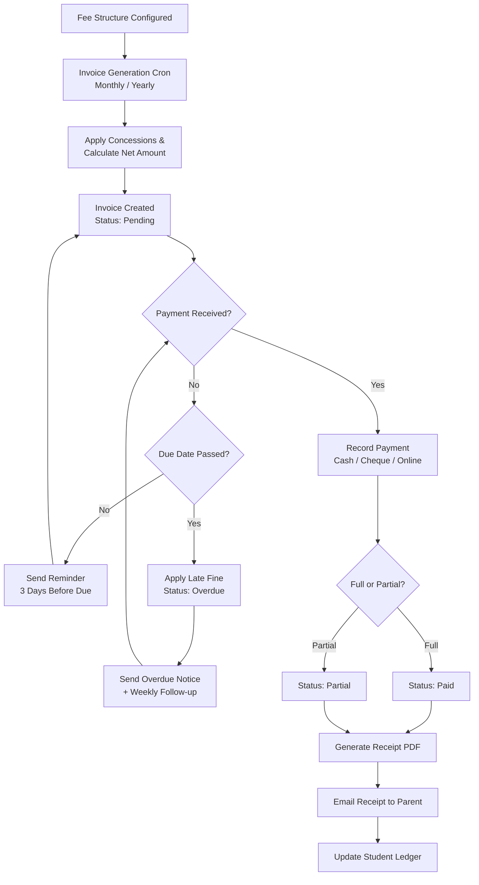

## 10. Fee & Finance Management

The Fee & Finance Management module forms the financial backbone of the School Management System, handling everything from fee structure configuration and collection workflow to financial reporting and expense tracking. This module serves multiple stakeholders — accountants record payments and generate receipts, administrators configure fee structures and approve concessions, students and parents view dues and make online payments, and finance managers analyze collection trends and monitor budget variance. The module must guarantee data integrity through immutable audit trails, support multiple payment modes, handle complex concession rules, and provide real-time visibility into the institution's financial health.

### 10.1 Fee Structure Configuration

#### 10.1.1 Fee Head Management

A **FeeHead** represents a distinct category of fee charged by the institution. The system supports ten standard fee heads: Tuition, Admission, Registration, Examination, Transport, Hostel, Library, Laboratory, Sports, and Late Fee. Each fee head carries a unique code (e.g., `TUITION`, `ADMISSION`), a human-readable description, a default frequency (one-time, monthly, quarterly, half-yearly, or annual), and an active/inactive status flag. Accountants with the appropriate role permissions can create custom fee heads beyond the standard set. The `FeeHead` schema references the `AcademicYear` model to allow versioned fee heads that evolve across years without affecting historical records. All CRUD operations on fee heads are logged to the audit trail with before-and-after value snapshots.

#### 10.1.2 Fee Structure Assignment

The **FeeStructure** model binds a fee head to a specific class, student category, and academic year with a defined amount. A single fee head can appear multiple times within the same academic year — once per class-category combination. The student category dimension supports the Indian reservation system: General, SC (Scheduled Caste), ST (Scheduled Tribe), and OBC (Other Backward Classes), each potentially carrying a different fee amount. The frequency field determines the billing cadence: one-time fees (admission, registration) are charged once upon enrollment; recurring fees (tuition, transport) generate periodic invoices based on their frequency. Academic year binding ensures that fee structures for the current year do not interfere with historical data, and schema-level validation prevents overlapping effective date ranges for the same class-category-head combination.

The following table illustrates a sample fee structure template for Grade 1 in the 2025–26 academic year:

| Fee Head | Category | Amount (INR) | Frequency | Billing Month(s) |
|---|---|---|---|---|
| Tuition Fee | General | 3,500 | Monthly | April–March |
| Tuition Fee | SC/ST | 1,750 | Monthly | April–March |
| Admission Fee | All | 5,000 | One-time | At enrollment |
| Examination Fee | All | 800 | Annual | January |
| Transport Fee | All | 1,200 | Monthly | April–March |
| Library Fee | All | 200 | Annual | April |
| Laboratory Fee | All | 500 | Annual | April |
| Sports Fee | All | 300 | Annual | April |
| Late Fee Fine | All | 50/day | Penalty | Post due date |

This table demonstrates the multi-dimensional nature of fee assignment: the Tuition Fee varies by student category (General pays double the SC/ST rate), while the Admission Fee applies uniformly across all categories. The Late Fee Fine row illustrates the penalty fee head, which uses a per-day calculation rather than a fixed amount. When rendering the fee structure configuration UI, React components group rows by fee head and use nested tables or expandable rows to display category-wise variations, with the `DataTable` component from Chapter 5 handling sortable column headers and pagination for large structures spanning multiple classes.

#### 10.1.3 Concessions and Scholarships

The **FeeConcession** model links a student to a specific fee head with a waiver defined as either a percentage or a fixed amount. The `concessionType` field stores either `percentage` or `fixed`, and the `value` field stores the numeric waiver (e.g., `50` for 50% or `500` for INR 500 off). A `netAmount` virtual field on the `StudentFee` document computes the final payable amount by subtracting the concession from the base fee structure amount. The system supports multiple concession categories: sibling discount (applies only to tuition fee, non-cumulative with other discounts), staff child discount (configurable percentage set by admin), merit-based scholarship (linked to the `StudentScholarship` model with academic performance criteria), and orphan/student-in-need category (requires documentary proof upload and admin approval). Concession records carry `effectiveFrom` and `effectiveTo` date fields to support time-bound waivers, and the approval workflow requires at least one authorized signatory (admin or finance manager) before the concession becomes active.

#### 10.1.4 Fine Rules

Fine configuration lives in the **FineConfiguration** model, which stores the rules for late fee computation. The `fineType` field accepts `percentage_per_day` or `fixed_per_day`, and the `fineAmount` field stores the daily penalty value. A `graceDays` field (default 0) defines the buffer period after the due date before fines begin accruing. The `maxFine` field enforces a ceiling on the total penalty to prevent excessive accumulation — a critical business rule for institutions serving economically disadvantaged students. When a fine exceeds a threshold set in the configuration, the system triggers a waiver approval workflow: the accountant initiates a waiver request with a reason and supporting documents, the finance manager reviews and approves or rejects, and the final decision is recorded in the audit trail. The fine calculation engine runs as a scheduled job at midnight each day, iterating over all invoices with `status: 'Pending'` and a past due date to compute and append fine line items.

### 10.2 Fee Collection Workflow

#### 10.2.1 Student Fee Ledger

The student fee ledger provides a comprehensive view of all financial transactions for an individual student. The **FeeInvoice** model serves as the primary ledger document, with each invoice representing a billing period (month for recurring fees, one-time for non-recurring). The invoice carries fields for `totalAmount` (sum of all fee head amounts), `concessionAmount` (aggregate waivers), `fineAmount` (computed late fees), `netAmount` (total minus concessions plus fines), `paidAmount` (sum of all payment receipts), and `balanceAmount` (net minus paid). The ledger supports filtering by academic year and payment status, and the running balance updates in real time as new payments are recorded.

The following code sample implements the core fee calculation logic that runs during invoice generation:

```javascript
// server/services/feeCalculationService.js
const FeeStructure = require('../models/FeeStructure');
const FeeConcession = require('../models/FeeConcession');
const FineConfiguration = require('../models/FineConfiguration');

/**
 * Calculate net fee amount for a student considering
 * fee structure, concessions, and applicable fines.
 */
async function calculateStudentFee(studentId, classId, category, academicYearId, billingMonth) {
  // Fetch all active fee structures for the student's class and category
  const feeStructures = await FeeStructure.find({
    classId,
    category: { $in: [category, 'All'] },
    academicYearId,
    status: 'active'
  }).populate('feeHeadId');

  let totalAmount = 0;
  const lineItems = [];

  for (const fs of feeStructures) {
    // Skip non-applicable recurring fees for this billing month
    if (fs.frequency === 'monthly' && fs.billingMonth !== billingMonth) continue;
    if (fs.frequency === 'quarterly' && !isQuarterMonth(fs, billingMonth)) continue;

    // Fetch applicable concessions for this student and fee head
    const concessions = await FeeConcession.find({
      studentId,
      feeHeadId: fs.feeHeadId._id,
      status: 'approved',
      effectiveFrom: { $lte: new Date() },
      $or: [{ effectiveTo: { $gte: new Date() } }, { effectiveTo: null }]
    });

    let concessionAmount = 0;
    for (const c of concessions) {
      concessionAmount += c.concessionType === 'percentage'
        ? (fs.amount * c.value) / 100
        : c.value;
    }

    const netAmount = Math.max(0, fs.amount - concessionAmount);
    totalAmount += netAmount;

    lineItems.push({
      feeHeadId: fs.feeHeadId._id,
      feeHeadName: fs.feeHeadId.name,
      baseAmount: fs.amount,
      concessionAmount: Math.round(concessionAmount * 100) / 100,
      netAmount: Math.round(netAmount * 100) / 100,
      frequency: fs.frequency
    });
  }

  // Calculate late fee fine if invoice is past due
  const fineConfig = await FineConfiguration.findOne({ feeHeadId: null, status: 'active' });
  let fineAmount = 0;
  if (fineConfig) {
    const dueDate = new Date(getDueDate(academicYearId, billingMonth));
    const graceDate = new Date(dueDate);
    graceDate.setDate(graceDate.getDate() + fineConfig.graceDays);

    if (new Date() > graceDate) {
      const daysOverdue = Math.floor((new Date() - graceDate) / (1000 * 60 * 60 * 24));
      fineAmount = fineConfig.fineType === 'fixed_per_day'
        ? daysOverdue * fineConfig.fineAmount
        : (totalAmount * fineConfig.fineAmount * daysOverdue) / 100;
      fineAmount = Math.min(fineAmount, fineConfig.maxFine); // Enforce cap
    }
  }

  return {
    totalAmount: Math.round(totalAmount * 100) / 100,
    concessionAmount: Math.round(lineItems.reduce((s, i) => s + i.concessionAmount, 0) * 100) / 100,
    fineAmount: Math.round(fineAmount * 100) / 100,
    netAmount: Math.round((totalAmount + fineAmount) * 100) / 100,
    lineItems,
    dueDate: getDueDate(academicYearId, billingMonth)
  };
}

module.exports = { calculateStudentFee };
```

This service function aggregates fee structures, applies concessions, and computes late fines in a single call. It filters fee structures by the student's class and category, applies time-bound concessions from the `FeeConcession` collection, and calculates overdue fines using the `FineConfiguration` rules with the configured maximum cap. The function returns a fully computed invoice payload that the invoice generation controller persists to the database.

#### 10.2.2 Payment Recording

The payment recording API accepts multiple payment modes: **cash** (with collector name and counter ID), **cheque** (with cheque number, bank name, cheque date, and clearance status), and **online** (with UPI ID, card reference, net banking transaction ID, or payment gateway response). The system accepts partial payments — the business rule requires the minimum payment to be at least 50% of the net due amount unless waived by an authorized user. Each payment record creates a `FeeReceipt` document linked to the invoice, and the invoice's `paidAmount` and `balanceAmount` fields update atomically within a MongoDB transaction to prevent race conditions in concurrent payment scenarios.

The following controller handles payment recording:

```javascript
// server/controllers/feePaymentController.js
const mongoose = require('mongoose');
const FeeInvoice = require('../models/FeeInvoice');
const FeeReceipt = require('../models/FeeReceipt');
const AppError = require('../utils/AppError');

/**
 * POST /api/v1/fee-payments/record
 * Record a fee payment against an invoice with full transaction safety.
 */
exports.recordPayment = async (req, res, next) => {
  const session = await mongoose.startSession();
  session.startTransaction();

  try {
    const { invoiceId, amount, paymentMode, paymentDetails, collectedBy } = req.body;

    // Fetch and lock the invoice within the transaction
    const invoice = await FeeInvoice.findById(invoiceId).session(session);
    if (!invoice) throw new AppError('Invoice not found', 404);
    if (invoice.status === 'paid') throw new AppError('Invoice already fully paid', 409);
    if (invoice.status === 'cancelled') throw new AppError('Cannot pay against a cancelled invoice', 409);

    // Validate minimum partial payment (50% of balance unless waived)
    const balance = invoice.netAmount - invoice.paidAmount;
    if (amount < balance * 0.5 && !req.body.waiverApproved) {
      throw new AppError(`Minimum payment is 50% of balance (${balance * 0.5})`, 400);
    }
    if (amount > balance) throw new AppError(`Payment exceeds balance amount (${balance})`, 400);

    // Generate unique receipt number: REC-YYYY-XXXXX
    const year = new Date().getFullYear();
    const receiptCount = await FeeReceipt.countDocuments({
      receiptNo: { $regex: `^REC-${year}` }
    }).session(session);
    const receiptNo = `REC-${year}-${String(receiptCount + 1).padStart(5, '0')}`;

    // Create the receipt document
    const receipt = await FeeReceipt.create([{
      receiptNo,
      invoiceId,
      studentId: invoice.studentId,
      amount,
      paymentMode,
      transactionReference: paymentDetails.transactionId || paymentDetails.chequeNo || null,
      bankName: paymentDetails.bankName || null,
      chequeNo: paymentDetails.chequeNo || null,
      chequeDate: paymentDetails.chequeDate || null,
      collectedBy,
      collectedAt: new Date(),
      status: paymentMode === 'cheque' ? 'pending_clearance' : 'completed'
    }], { session });

    // Atomically update the invoice
    const newPaidAmount = invoice.paidAmount + amount;
    const newBalance = invoice.netAmount - newPaidAmount;
    const newStatus = newBalance <= 0 ? 'paid' : 'partial';

    await FeeInvoice.findByIdAndUpdate(invoiceId, {
      $set: {
        paidAmount: Math.round(newPaidAmount * 100) / 100,
        balanceAmount: Math.round(Math.max(0, newBalance) * 100) / 100,
        status: newStatus,
        lastPaymentDate: new Date()
      }
    }, { session });

    await session.commitTransaction();

    res.status(201).json({
      success: true,
      data: {
        receipt: receipt[0],
        invoiceStatus: newStatus,
        remainingBalance: Math.max(0, newBalance)
      },
      message: `Payment of ${amount} recorded successfully. Receipt: ${receiptNo}`
    });
  } catch (err) {
    await session.abortTransaction();
    next(err);
  } finally {
    session.endSession();
  }
};
```

The controller wraps all payment recording logic inside a MongoDB multi-document transaction. It validates the payment amount against business rules, generates a sequentially numbered receipt, creates the receipt document, and updates the invoice status atomically. If any step fails, the transaction aborts and no partial writes persist to the database — this prevents the critical data integrity failure of recording a receipt without updating the invoice balance.

#### 10.2.3 Receipt Generation

Every successful payment generates a receipt with a unique number following the format `REC-YYYY-XXXXX` (e.g., `REC-2025-00042`). The receipt includes a full fee breakup by head, the concession details, any fine applied, the payment mode with reference details, and a digital signature placeholder. The PDF generation pipeline uses Puppeteer to render an HTML template with school branding and convert it to a downloadable PDF document.

The following service generates receipt PDFs and triggers email delivery:

```javascript
// server/services/receiptService.js
const puppeteer = require('puppeteer');
const path = require('path');
const fs = require('fs');
const nodemailer = require('nodemailer');
const FeeReceipt = require('../models/FeeReceipt');
const FeeInvoice = require('../models/FeeInvoice');
const Student = require('../models/Student');

/**
 * Generate a PDF receipt for a fee payment and optionally email it.
 */
async function generateReceiptPDF(receiptId, options = {}) {
  const receipt = await FeeReceipt.findById(receiptId)
    .populate('studentId', 'firstName lastName admissionNo classId')
    .populate('invoiceId')
    .populate('collectedBy', 'firstName lastName');

  if (!receipt) throw new Error('Receipt not found');

  const student = receipt.studentId;
  const invoice = receipt.invoiceId;

  // Build the HTML receipt template
  const html = `
  <!DOCTYPE html>
  <html>
  <head>
    <meta charset="utf-8">
    <style>
      @page { size: A4; margin: 20mm; }
      body { font-family: 'Segoe UI', Arial, sans-serif; font-size: 12px; color: #333; }
      .header { text-align: center; border-bottom: 3px solid #4f46e5; padding-bottom: 10px; margin-bottom: 20px; }
      .header h1 { margin: 0; font-size: 22px; color: #4f46e5; }
      .header p { margin: 4px 0; color: #666; }
      .receipt-meta { display: flex; justify-content: space-between; margin-bottom: 20px; }
      .box { border: 1px solid #ddd; padding: 10px; border-radius: 4px; width: 48%; }
      .box h3 { margin: 0 0 8px 0; font-size: 13px; color: #4f46e5; }
      table { width: 100%; border-collapse: collapse; margin: 15px 0; }
      th, td { border: 1px solid #ddd; padding: 8px; text-align: left; }
      th { background: #f3f4f6; font-weight: 600; }
      .text-right { text-align: right; }
      .total-row { font-weight: bold; background: #eef2ff; }
      .footer { margin-top: 30px; display: flex; justify-content: space-between; }
      .signature-box { border-top: 1px solid #333; width: 150px; text-align: center; padding-top: 5px; }
      .stamp { text-align: center; color: #999; font-style: italic; }
    </style>
  </head>
  <body>
    <div class="header">
      <h1>Fee Payment Receipt</h1>
      <p>${process.env.SCHOOL_NAME || 'School Management System'}</p>
      <p>${process.env.SCHOOL_ADDRESS || ''}</p>
    </div>
    <div class="receipt-meta">
      <div class="box">
        <h3>Receipt Details</h3>
        <p><strong>Receipt No:</strong> ${receipt.receiptNo}</p>
        <p><strong>Date:</strong> ${receipt.collectedAt.toLocaleDateString('en-IN')}</p>
        <p><strong>Payment Mode:</strong> ${receipt.paymentMode.toUpperCase()}</p>
        ${receipt.transactionReference ? `<p><strong>Reference:</strong> ${receipt.transactionReference}</p>` : ''}
        ${receipt.chequeNo ? `<p><strong>Cheque No:</strong> ${receipt.chequeNo}</p><p><strong>Bank:</strong> ${receipt.bankName}</p>` : ''}
      </div>
      <div class="box">
        <h3>Student Details</h3>
        <p><strong>Name:</strong> ${student.firstName} ${student.lastName}</p>
        <p><strong>Admission No:</strong> ${student.admissionNo}</p>
        <p><strong>Class:</strong> ${student.classId?.name || 'N/A'}</p>
      </div>
    </div>
    <table>
      <thead>
        <tr><th>Fee Head</th><th class="text-right">Amount (INR)</th></tr>
      </thead>
      <tbody>
        ${invoice.lineItems.map(item => `
          <tr>
            <td>${item.feeHeadName} ${item.concessionAmount > 0 ? `<small>(Concession: -${item.concessionAmount})</small>` : ''}</td>
            <td class="text-right">${item.netAmount.toFixed(2)}</td>
          </tr>
        `).join('')}
        ${invoice.fineAmount > 0 ? `<tr><td>Late Fee Fine</td><td class="text-right">${invoice.fineAmount.toFixed(2)}</td></tr>` : ''}
        <tr class="total-row"><td>Total Paid</td><td class="text-right">${receipt.amount.toFixed(2)}</td></tr>
      </tbody>
    </table>
    <div class="stamp">This is a computer-generated receipt and does not require a physical signature.</div>
    <div class="footer">
      <div class="signature-box">Authorized Signature</div>
      <div style="text-align:right;color:#666;font-size:11px;">
        Collected by: ${receipt.collectedBy?.firstName || 'System'}<br>
        Thank you for your payment.
      </div>
    </div>
  </body>
  </html>`;

  // Generate PDF with Puppeteer
  const browser = await puppeteer.launch({ headless: 'new' });
  const page = await browser.newPage();
  await page.setContent(html, { waitUntil: 'networkidle0' });
  const outputDir = path.join(__dirname, '../../uploads/receipts');
  if (!fs.existsSync(outputDir)) fs.mkdirSync(outputDir, { recursive: true });
  const pdfPath = path.join(outputDir, `${receipt.receiptNo}.pdf`);
  await page.pdf({ path: pdfPath, format: 'A4', printBackground: true });
  await browser.close();

  // Update receipt with PDF path
  await FeeReceipt.findByIdAndUpdate(receiptId, { pdfUrl: `/uploads/receipts/${receipt.receiptNo}.pdf` });

  // Auto-email receipt if student has a registered parent email
  if (options.sendEmail !== false) {
    await emailReceipt(receipt, pdfPath);
  }

  return pdfPath;
}

async function emailReceipt(receipt, pdfPath) {
  const student = await Student.findById(receipt.studentId).populate('guardianIds');
  const parentEmail = student.guardianIds?.[0]?.email;
  if (!parentEmail) return;

  const transporter = nodemailer.createTransport({
    host: process.env.EMAIL_HOST,
    port: process.env.EMAIL_PORT,
    auth: { user: process.env.EMAIL_USER, pass: process.env.EMAIL_PASS }
  });

  await transporter.sendMail({
    from: `"${process.env.SCHOOL_NAME}" <${process.env.EMAIL_USER}>`,
    to: parentEmail,
    subject: `Fee Receipt - ${receipt.receiptNo}`,
    html: `<p>Dear Parent,</p><p>Your fee payment of <strong>INR ${receipt.amount.toFixed(2)}</strong> has been received. Receipt <strong>${receipt.receiptNo}</strong> is attached.</p><p>Thank you.</p>`,
    attachments: [{ filename: `${receipt.receiptNo}.pdf`, path: pdfPath }]
  });
}

module.exports = { generateReceiptPDF };
```

The receipt generation service uses Puppeteer to render a styled HTML template into an A4 PDF. The template includes the school header (configured via environment variables), student details, a line-item table of fee heads with concession annotations, fine amounts, and payment metadata. After PDF generation, the service emails the receipt to the student's registered parent email using Nodemailer with the PDF as an attachment. The generated PDF path is stored on the receipt document for subsequent re-downloads without re-rendering.

#### 10.2.4 Payment Status Tracking

Every invoice maintains a status field that transitions through a defined lifecycle. The status values and their semantics are:

| Status | Definition | Color Code | Trigger Condition |
|---|---|---|---|
| Paid | Full payment received, zero balance | Green (`#22c55e`) | `balanceAmount <= 0` |
| Partial | Partial payment received, balance outstanding | Amber (`#f59e0b`) | `paidAmount > 0 && balanceAmount > 0` |
| Pending | No payment received, still within due date | Blue (`#3b82f6`) | `paidAmount == 0 && today <= dueDate` |
| Overdue | No payment or partial payment, past due date | Red (`#ef4444`) | `balanceAmount > 0 && today > dueDate + graceDays` |

The status field updates automatically through the payment recording controller and the nightly fine calculation cron job. The React frontend renders these statuses using the `StatusBadge` component from Chapter 5 with the assigned color codes, enabling accountants to identify overdue accounts at a glance. A scheduled job running daily at 6:00 AM recalculates all invoice statuses and triggers automated reminder notifications for invoices approaching or exceeding their due dates.

The complete fee payment flow from invoice generation through receipt delivery is illustrated below:



This flowchart shows the cyclic nature of the payment workflow: invoices start as Pending, transition to Overdue if unpaid past the due date (triggering fine accumulation and escalation notices), and resolve to either Paid or Partial when payment arrives. The partial payment path loops back into the cycle, allowing students to pay in installments across multiple transactions until the balance reaches zero.

### 10.3 Financial Reporting

#### 10.3.1 Daily Collection Report

The daily collection report aggregates all fee receipts recorded within a 24-hour window. It groups payments by mode (cash, cheque, online) with subtotals per mode and a grand total, then further breaks down by cashier to support individual accountability. A deposit reconciliation section compares the cash total against the recorded bank deposit slip, flagging any variance for investigation. The report API accepts a `date` parameter and returns the structured data; the frontend renders it using the `DataTable` component with export options for PDF and Excel.

#### 10.3.2 Monthly and Annual Analytics

The analytics module compares actual fee collections against targets set per class and per fee head. A month-over-month trend API returns collection totals for the last 12 months, enabling the frontend to render a Recharts line chart showing seasonal patterns (typically lower collection during vacation months). The class-wise collection summary groups all receipts by the student's enrolled class, revealing collection disparities that may indicate enrollment shifts or fee structure imbalances. The year-end financial summary rolls up all data into a single executive report with charts for collection distribution, concession impact, and fine revenue.

#### 10.3.3 Outstanding Dues Analysis

The outstanding dues report segments unpaid balances by age: 0–30 days (current), 31–60 days, 61–90 days, and 90+ days (severe delinquency). Each aging bucket computes a total outstanding amount and student count. The student-wise defaulter list queries all invoices with `status: 'overdue'`, joins student and parent contact data, and sorts by descending balance amount. The total outstanding dashboard widget displays the aggregate overdue amount across all aging buckets and updates every 5 minutes via the analytics cache layer described in Chapter 12. A business rule flags students with 90+ day overdue balances for administrative action, including potential examination registration barring.

#### 10.3.4 Automated Reminders

The reminder engine operates on a three-tier schedule. Three days before the due date, the system sends a polite fee due reminder via SMS and email containing the invoice amount and a payment link. On the due date, the tone shifts to an overdue notice. For invoices remaining unpaid, weekly follow-up notices escalate the urgency. Each reminder creates a `FeeReminder` log entry tracking the reminder type, channel, timestamp, and delivery status. The reminder dispatcher uses the notification queue from Chapter 12 to handle high-volume sends without blocking the main application thread, and it respects parent notification preferences configured in their profile.

### 10.4 Expense & Budget Tracking

#### 10.4.1 Expense Management

The **Expense** model records institutional expenditures categorized into predefined types: salaries, utilities (electricity, water, internet), maintenance (building repairs, equipment servicing), supplies (stationery, laboratory materials), and events (annual day, sports meet). Each expense entry captures the amount, date, vendor, description, and an uploaded receipt image or PDF. A two-level approval workflow governs large expenses: entries below a configurable threshold (default INR 10,000) require a single accountant approval, while amounts exceeding the threshold need additional finance manager sign-off. The approval chain uses the same audit trail mechanism as fee concessions, recording approver identity, timestamp, and decision reason.

#### 10.4.2 Income Summary

Beyond fee collection, the income module aggregates all revenue streams: donations (with donor details and 80G tax exemption receipt eligibility), government grants (tagged by scheme and utilization period), and miscellaneous income (rental income, event sponsorships). The monthly income statement API groups all income by category and compares it against the same month in the previous academic year, computing a year-over-year growth percentage. This data feeds directly into the analytics dashboard described in Chapter 12, giving administrators a consolidated view of institutional revenue health.

#### 10.4.3 Budgeting

The **Budget** model defines annual allocation amounts per expense category. At the start of each financial year, administrators input budget estimates based on historical spending and planned initiatives. As expenses are recorded, the system computes a real-time **actual vs. budget variance** for each category. Categories where actual spending exceeds 90% of the budget trigger an overspend alert to the finance manager. Budget revisions mid-year follow a formal workflow: the accountant proposes a revised amount with justification, the finance manager reviews, and approved revisions are versioned with the previous budget preserved for audit. The variance report displays each category with three columns — budgeted amount, actual spent, and variance percentage — with negative variances (underspend) in green and positive variances (overspend) in red, providing immediate visual feedback on fiscal discipline.
