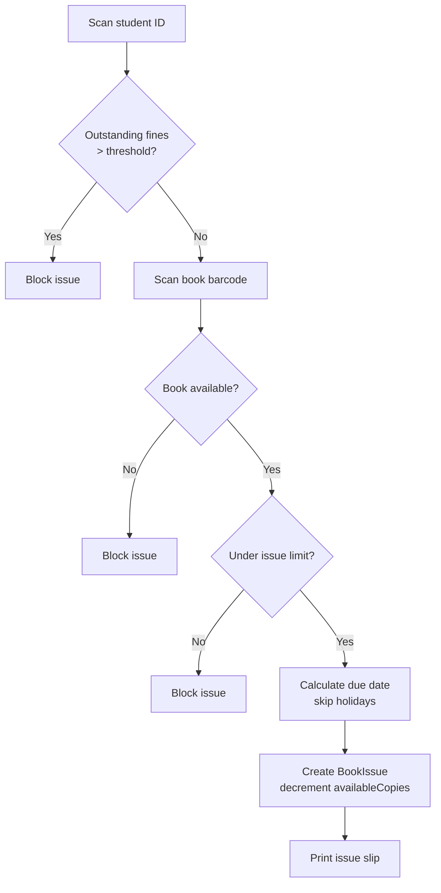
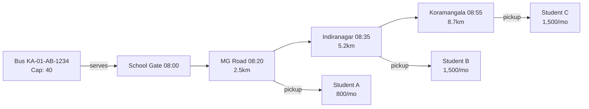

## 11. Library, Transport & Hostel Management

The Library, Transport, and Hostel modules manage physical school resources — books, vehicles, and residential rooms — integrating with the Fee module from Chapter 10 to generate invoice line items for library fines, transport fees, and hostel rent.

### 11.1 Library Management Module

#### 11.1.1 Book Catalog

The **Book** schema stores bibliographic metadata; **BookCopy** tracks individual copies with accession numbers. The catalog supports MARC record import.

| Field | Type | Description | Example |
|---|---|---|---|
| `isbn` | String (unique) | ISBN | 978-0-13-468599-1 |
| `title` | String (indexed) | Book title | Clean Code |
| `authors` | [String] | Author(s) | [Robert C. Martin] |
| `publisher` | String | Publishing house | Prentice Hall |
| `edition` | String | Edition | 1st Edition |
| `categoryId` | ObjectId | Classification ref | 005.1 Programming |
| `shelfLocation` | String | Rack position | R-A3-S12 |
| `totalCopies` | Number | Copies owned | 5 |
| `availableCopies` | Number | Copies available | 2 |
| `coverImageUrl` | String | Cover path | /uploads/covers/123.jpg |
| `marcRecord` | Object | MARC21 fields | { leader, dataFields } |

`availableCopies` denormalizes to avoid checkout aggregation. Each BookCopy has accession number `ACC-[YEAR]-[SEQUENCE]`, barcode, and status enum.

#### 11.1.2 Book Operations

Adding triggers barcode generation via `bwip-js` and creates BookCopy records. ISBN lookup (Google Books) auto-populates fields. Bulk import accepts CSV; the parser inserts validated records in a transaction. Editing updates Book only. Marking `lost`/`damaged` decrements `totalCopies`. Deletion is blocked if copies are in circulation; status changes to `archived` instead.

#### 11.1.3 Book Issue Workflow

Issue workflow scans student ID and barcode, validates fines, enforces limits, computes due date skipping holidays.



The controller implements this workflow:

```javascript
// server/controllers/libraryController.js
const Book = require('../models/Book');
const BookCopy = require('../models/BookCopy');
const BookIssue = require('../models/BookIssue');
const FineTransaction = require('../models/LibraryFineTransaction');
const { addBusinessDays } = require('../utils/dateUtils');
const catchAsync = require('../utils/catchAsync');

exports.issueBook = catchAsync(async (req, res) => {
  const { userId, userType, bookCopyId } = req.body;
  const settings = await LibrarySettings.findOne();

  const fines = await FineTransaction.aggregate([
    { $match: { userId: new mongoose.Types.ObjectId(userId), status: 'pending' } },
    { $group: { _id: null, total: { $sum: '$amount' } } }
  ]);
  if ((fines[0]?.total || 0) > settings.fineBlockThreshold) {
    return res.status(409).json({ success: false, message: 'Outstanding fine exceeds threshold' });
  }

  const maxBooks = userType === 'teacher' ? settings.maxBooksTeacher : settings.maxBooksStudent;
  const active = await BookIssue.countDocuments({ userId, userType, status: { $in: ['issued', 'overdue'] } });
  if (active >= maxBooks) return res.status(409).json({ success: false, message: 'Issue limit reached' });

  const copy = await BookCopy.findById(bookCopyId);
  if (!copy || copy.status !== 'available') return res.status(409).json({ success: false, message: 'Copy unavailable' });

  const dueDate = addBusinessDays(new Date(), settings.issueDaysStudent, settings.holidayDates);

  const session = await mongoose.startSession();
  await session.withTransaction(async () => {
    await BookIssue.create([{ bookCopyId, userId, userType, issueDate: new Date(), dueDate, status: 'issued', issuedBy: req.user._id }], { session });
    await BookCopy.findByIdAndUpdate(bookCopyId, { status: 'issued' }, { session });
    await Book.findByIdAndUpdate(copy.bookId, { $inc: { availableCopies: -1 } }, { session });
  });
  await session.endSession();

  res.status(201).json({ success: true, data: { dueDate } });
});
```

#### 11.1.4 Return Processing

Return processing scans the barcode, locates the active BookIssue, and computes overdue days as `max(0, returnDate - dueDate)`. The fine: `max(0, overdueDays - graceDays) * finePerDay`, capped at `maxFine`. A FineTransaction is created; BookCopy reverts to `available` and `availableCopies` increments.

#### 11.1.5 Reservation and Renewal

When all copies are issued, students may reserve via **BookReservation** (`bookId`, `userId`, `queuePosition`, `status`). On return, the first reserver gets a 48-hour hold. Renewal extends the due date if no reservation exists and `renewalCount < maxRenewals` (default 2).

#### 11.1.6 Library Reports

Six built-in aggregation views: currently issued, overdue with fines, most borrowed, never-borrowed, category-wise inventory, and fine collection summary. All support CSV/Excel export via `xlsx`.

### 11.2 Transport Management Module

#### 11.2.1 Vehicle Fleet

The **Vehicle** schema registers buses with registration, make/model, capacity, insurance/fitness expiry, `gpsDeviceId`, and `conditionStatus`. A unique index on `assignedDriverId` enforces one driver per vehicle.

#### 11.2.2 Route Management

A **TransportRoute** defines ordered stops with geolocation, sequence, arrival time, and distance from start.

| Attribute | Type | Description | Example |
|---|---|---|---|
| `routeName` | String | Route name | Route 42 - East Campus |
| `routeCode` | String | Unique code | RT-E42 |
| `stops` | [Object] | Ordered stop list | See sub-fields |
| `fareSlab` | String | Distance tier | 5-10km |
| `baseFare` | Number | Monthly fare | 1,500 |
| `assignedVehicleId` | ObjectId | Vehicle ref | 64a1... |
| `assignedDriverId` | ObjectId | Driver ref | 64b2... |

Each stop has: `stopName`, `sequence`, `latitude`, `longitude`, `arrivalTime`, `distanceFromStart`. ETA recalculation uses 20 km/h average plus 3 minutes boarding per stop.



#### 11.2.3 Student Transport Allocation

The **StudentTransport** model links a student to a route and pickup/drop stops, triggering fee integration:

```javascript
// server/controllers/transportController.js
const StudentTransport = require('../models/StudentTransport');
const TransportRoute = require('../models/TransportRoute');
const Vehicle = require('../models/Vehicle');
const FeeStructure = require('../models/FeeStructure');
const catchAsync = require('../utils/catchAsync');

exports.allocateStudent = catchAsync(async (req, res) => {
  const { studentId, routeId, pickupStopId, dropStopId, feeSlab } = req.body;

  const route = await TransportRoute.findById(routeId).populate('assignedVehicleId');
  if (!route || route.status !== 'active') return res.status(404).json({ success: false, message: 'Route inactive' });

  const stopIds = route.stops.map(s => s._id.toString());
  if (!stopIds.includes(pickupStopId)) return res.status(400).json({ success: false, message: 'Invalid stop' });

  const allocated = await StudentTransport.countDocuments({ routeId, status: 'active' });
  if (allocated >= route.assignedVehicleId.capacity) return res.status(409).json({ success: false, message: 'Capacity exceeded' });

  const slabFares = { '0-5km': 800, '5-10km': 1500, '10+km': 2200 };
  const fare = slabFares[feeSlab] || 800;

  await StudentTransport.create({ studentId, routeId, pickupStopId, dropStopId, transportFee: fare, effectiveFrom: new Date(), status: 'active' });

  res.status(201).json({ success: true, data: { routeName: route.routeName, monthlyFare: fare } });
});
```

#### 11.2.4 Transport Fee

Transport fees bill monthly in advance using distance slabs: 0–5 km (INR 800), 5–10 km (INR 1,500), 10+ km (INR 2,200). Non-payment by the 10th triggers a late fine. Pass cancellation requires 5 working days notice with prorated refund.

#### 11.2.5 Vehicle Maintenance

The **VehicleMaintenance** schema logs `type`, `cost`, `vendor`, and `nextServiceDate`. A nightly job alerts 7 days before service or every 5,000 km.

#### 11.2.6 Transport Attendance

Drivers mark pickup/drop attendance via mobile app, recording GPS and timestamps to **TransportAttendance**. Absent students trigger parent SMS alerts. Route deviation beyond 500 meters from the planned polyline raises real-time alerts.

### 11.3 Hostel Management Module

#### 11.3.1 Room Inventory

The **HostelRoom** schema organizes: building/block, floor, room number, bed positions. `roomType` (`single`, `double`, `triple`, `dormitory`) sets capacity. Amenities embed as `['wifi', 'ac', 'attached_bathroom']`. `currentOccupancy` denormalizes via post-save hooks on **HostelAllocation**.

#### 11.3.2 Room Allocation

Students submit preferences; the warden reviews against vacancies; on approval, the system creates a HostelAllocation linking student, room, and bed.

| Entity | Key Fields | Purpose |
|---|---|---|
| **HostelApplication** | studentId, preferredRoomType, roommatePreferenceIds, status | Captures student preferences |
| **HostelRoom** | hostelId, roomNo, floor, roomType, capacity, occupiedBeds, monthlyRent | Room inventory record |
| **HostelAllocation** | studentId, roomId, bedId, allocationDate, status | Links student to physical bed |
| **HostelFee** | studentId, allocationId, roomRent, messCharges, totalAmount, status | Billing record per cycle |

The allocation controller enforces capacity limits and gender-segregated occupancy:

```javascript
// server/controllers/hostelController.js
const HostelRoom = require('../models/HostelRoom');
const HostelAllocation = require('../models/HostelAllocation');
const HostelFee = require('../models/HostelFee');
const catchAsync = require('../utils/catchAsync');

exports.allocateRoom = catchAsync(async (req, res) => {
  const { applicationId, roomId, bedId } = req.body;

  const app = await HostelApplication.findById(applicationId).populate('studentId', 'gender');
  if (!app || app.status !== 'pending') return res.status(400).json({ success: false, message: 'Invalid application' });

  const room = await HostelRoom.findById(roomId);
  if (!room || room.occupiedBeds >= room.capacity) return res.status(409).json({ success: false, message: 'Room full' });

  const existing = await HostelAllocation.findOne({ roomId, status: 'active' }).populate('studentId', 'gender');
  if (existing && existing.studentId.gender !== app.studentId.gender) return res.status(409).json({ success: false, message: 'Gender mismatch' });

  const session = await mongoose.startSession();
  await session.withTransaction(async () => {
    const alloc = await HostelAllocation.create([{ studentId: app.studentId._id, roomId, bedId, allocationDate: new Date(), status: 'active' }], { session });
    await HostelRoom.findByIdAndUpdate(roomId, { $inc: { occupiedBeds: 1 } }, { session });
    await HostelApplication.findByIdAndUpdate(applicationId, { status: 'approved' }, { session });
    await HostelFee.create([{ studentId: app.studentId._id, allocationId: alloc[0]._id, roomRent: room.monthlyRent, messCharges: 3000, totalAmount: room.monthlyRent + 3000, status: 'pending' }], { session });
  });
  await session.endSession();

  res.status(201).json({ success: true, data: { roomNo: room.roomNo, rent: room.monthlyRent } });
});
```

#### 11.3.3 Warden Management

Each block has one warden (`wardenId`). **WardenDutyRoster** defines shifts. Complaint resolution: students register with category/priority; warden acknowledges within 4 hours; high-priority items escalate to the supervisor.

#### 11.3.4 Hostel Fee

Hostel billing aggregates room rent (INR 4,000–8,000 by room type), mess charges (INR 3,000), and amenities fee. FeeIntegrationService from Chapter 10 pulls HostelFee records into the monthly invoice pipeline.

#### 11.3.5 Visitor Log

The **HostelVisitor** schema captures visitor name, relation, phone, ID proof, purpose, entry/exit times, and warden `approvalStatus`. Photo ID uploads store in `/uploads/visitor-ids/` with 90-day retention. Visiting hours default to 4:00 PM – 7:00 PM; entries outside require supervisor override.

#### 11.3.6 Hostel Operations

Daily operations include: **Roll call** (9:00–10:00 PM, absent alerts to parents); **Leave requests** (day/weekend/vacation leave with destination and emergency contact, warden approval mandatory); **Complaint registration** (maintenance/disciplinary/amenities with 72-hour SLA); and **Mess menu management** (weekly menu publishing). All functions expose REST endpoints under `/api/v1/hostel/` with RBAC.
