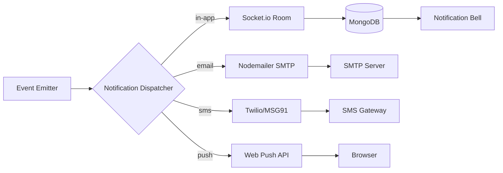

## 12. Communication, Reports & Analytics

### 12.1 Internal Communication System

The communication layer connects administrators, teachers, parents, and students through targeted messaging tools that minimize information overload while ensuring critical messages reach the intended audience.

#### 12.1.1 Announcements

Announcements provide role-targeted broadcasting to `teacher-only`, `parent-only`, `school-wide`, or `class-specific` audiences via a rich text editor (TipTap) supporting formatted text and attachments. Administrators set `publishAt` for deferred publishing and `expiryDate` for automatic archival. The schema stores `targetType`, `targetIds[]`, and `requiresAcknowledgment` for compliance-critical notices.

#### 12.1.2 Notice Board

The notice board displays categorized notices (`academic`, `events`, `urgent`, `general`) with pinned items at the top. Read receipts track through a `NoticeRead` collection recording `(userId, noticeId, readAt)` tuples. Notices older than 90 days auto-archive but remain searchable.

#### 12.1.3 Messaging

Messaging enables teacher-to-parent direct communication and admin-to-staff broadcasts. Messages use a threading model with shared `threadId`; the `Message` schema captures `senderId`, `receiverId`, `content`, `attachmentUrl`, `isRead`, and `parentMessageId`. The inbox organizes into Inbox, Sent, and Archive tabs. Attachments upload via Multer to cloud storage.

#### 12.1.4 Parent-Teacher Meetings

PTM uses slot-based booking through `PtmSchedule` (date, time range, `slotDuration`). Parents book via `POST /api/v1/ptm/bookings`; reminders fire 24 hours and 1 hour before the slot. Teachers record `meetingNotes` and `actionItems[]` post-meeting.

### 12.2 Notification System

#### 12.2.1 Multi-Channel Architecture

Notifications deliver across four channels: **in-app** (Socket.io), **email** (Nodemailer/SMTP), **SMS** (Twilio/MSG91), and **browser push** (Web Push API). The `NotificationDispatcher` routes each notification based on event type and user `NotificationPreference` settings.



The dispatcher resolves recipients, loads preferences, and fans out payloads. In-app notifications persist to MongoDB and emit via Socket.io; email passes to Nodemailer; SMS routes through the gateway client; push subscriptions are delivered via the Web Push protocol.

#### 12.2.2 Email Integration

```javascript
// server/services/emailService.js
const nodemailer = require('nodemailer');
const hbs = require('handlebars');
const fs = require('fs').promises;
const path = require('path');

const transport = nodemailer.createTransport({
  pool: true, host: process.env.EMAIL_HOST,
  port: parseInt(process.env.EMAIL_PORT, 10),
  secure: process.env.EMAIL_PORT === '465',
  auth: { user: process.env.EMAIL_USER, pass: process.env.EMAIL_PASS },
  maxConnections: 5, maxMessages: 100,
});

async function sendTemplatedEmail({ to, templateName, variables, subject }) {
  const src = await fs.readFile(
    path.join(__dirname, '../templates/email', `${templateName}.hbs`), 'utf-8'
  );
  const html = hbs.compile(src)(variables);
  const info = await transport.sendMail({
    from: `"${variables.schoolName}" <${process.env.EMAIL_FROM}>`,
    to: to.join(', '), subject, html, text: html.replace(/<[^>]*>/g, ''),
  });
  await EmailLog.create({
    recipients: to, templateName, subject,
    messageId: info.messageId, status: 'sent', sentAt: new Date(),
  });
  return info;
}

module.exports = { sendTemplatedEmail };
```

`EmailLog` tracks delivery status (sent/delivered/bounced/failed). SMTP webhook callbacks flag invalid addresses to suppress future sends.

#### 12.2.3 SMS Gateway

SMS integrates via Twilio or MSG91 REST APIs using Handlebars templates with variable substitution (`{{studentName}}`, `{{amount}}`). Unicode enables regional language delivery. Webhooks update `SmsLog.status` for retry evaluation.

#### 12.2.4 Notification Templates

The template UI supports categories: `fee_reminder`, `attendance_alert`, `exam_result`, `general_announcement`, `emergency_broadcast`. Each defines `subject`, `body` with placeholders, and target `channel`. Multi-language versions are keyed by locale code and selected from the recipient's profile.

#### 12.2.5 Trigger-Based Notifications

The `NotificationTrigger` engine listens to domain events and evaluates timing rules before dispatching.

| Trigger Event | Timing Rule | Channels | Template Category | Recipient |
|---|---|---|---|---|
| Fee due reminder | 3 days before + on due date | Email, SMS, In-app | `fee_reminder` | Student + Parent |
| Absent alert | 30 minutes after marking | SMS, Push, In-app | `attendance_alert` | Parent |
| Exam schedule published | Immediate on publish | Email, In-app | `general_announcement` | Student + Parent |
| Result published | Immediate on publish | All channels | `exam_result` | Student + Parent |
| Emergency broadcast | Immediate, overrides prefs | All channels | `emergency_broadcast` | All users |
| PTM reminder | 24h + 1h before slot | Email, SMS, Push | `general_announcement` | Parent + Teacher |

```javascript
// server/services/notificationTrigger.js
const notificationDispatcher = require('./notificationDispatcher');
const { FeePayment, Attendance } = require('../models');

class NotificationTrigger {
  async onFeeDue({ feeInvoiceId }) {
    const inv = await FeePayment.findById(feeInvoiceId)
      .populate('studentId', 'firstName lastName guardianIds');
    const days = Math.ceil((inv.dueDate - Date.now()) / 8.64e7);
    if (days === 3 || days === 0) {
      await notificationDispatcher.dispatch({
        channels: ['email', 'sms', 'in-app'],
        recipients: [inv.studentId._id, ...inv.studentId.guardianIds],
        templateCategory: 'fee_reminder',
        variables: {
          studentName: `${inv.studentId.firstName} ${inv.studentId.lastName}`,
          amount: inv.balanceAmount, dueDate: inv.dueDate.toLocaleDateString(),
        },
      });
    }
  }

  async onAbsentMarked({ studentId, date }) {
    setTimeout(async () => {
      const rec = await Attendance.findOne({ studentId, date }).populate('studentId');
      if (rec?.status === 'absent') {
        await notificationDispatcher.dispatch({
          channels: ['sms', 'push', 'in-app'],
          recipients: rec.studentId.guardianIds || [],
          templateCategory: 'attendance_alert',
          variables: { studentName: rec.studentId.firstName, date },
        });
      }
    }, 30 * 60 * 1000);
  }
}

module.exports = new NotificationTrigger();
```

#### 12.2.6 Real-Time Delivery

Socket.io delivers in-app notifications to `userId` rooms. A Redis-backed retry queue handles failures with exponential backoff (5min, 15min, 1hr). The preference center at `/settings/notifications` allows per-channel toggles per category, with emergency broadcasts overriding all preferences.

### 12.3 Report Generation Engine

#### 12.3.1 Template System

Reports generate from parameterized HTML templates using Handlebars. `ReportTemplate` stores `name`, `category`, `htmlBody`, `cssStyles`, and `version`. Placeholders (`{{studentName}}`, `{{schoolLogoUrl}}`) resolve at generation time; page breaks use CSS `page-break-after: always`.

#### 12.3.2 ID Card Generation

ID cards follow the CR80 standard. The pipeline composites profile photo, Code 128 barcode, student details, and school logo into HTML rendered by Puppeteer to a 300 DPI PDF. Bulk generation iterates a class-section's active students into a multi-page PDF for PVC printing.

#### 12.3.3 Certificates

Four certificate types are supported: **bonafide**, **character**, **transfer certificate (TC)**, and **achievement**. Each has selectable templates with auto-filled details. The TC requires clearance from library, fees, hostel, and transport departments before generation.

#### 12.3.4 Export Formats

PDF uses Puppeteer for HTML-to-PDF rendering. Excel uses `xlsx` with styled headers and freeze panes. CSV provides plain-text portability. Print-friendly CSS (`@media print`) hides navigation for browser printing.

### 12.4 Analytics Dashboard

#### 12.4.1 Dashboard Layout

The dashboard assembles KPI cards, charts, activity feed, and quick actions into a unified React view.

```mermaid
flowchart TB
    subgraph TopBar[""]
        A1[Total Students]
        A2[Present Today]
        A3[Fee Collected]
        A4[Pending Dues]
    end
    subgraph Charts[""]
        B1[Line: Enrollment Trend]
        B2[Pie: Gender Ratio]
        B3[Bar: Class Distribution]
        B4[Gauge: Fee Target %]
    end
    subgraph Side[""]
        C1[Recent Activity]
        C2[Quick Actions]
    end
    TopBar --> Charts
    Charts --> Side
```

KPI cards fetch from `GET /api/v1/analytics/kpi` using MongoDB aggregation. Each card shows current value, comparison versus prior period, and trend icon. A date range selector propagates to all widgets via `DateRangeContext`.

#### 12.4.2 Student Analytics

Enrollment trend renders as a line chart of monthly admissions. Gender ratio displays in a pie chart. Class distribution uses a vertical bar chart per grade. A comparison widget overlays admissions against withdrawals.

#### 12.4.3 Fee Analytics

Collection performance uses a gauge chart (actual versus target). Monthly trend overlays current-year and prior-year data. Payment mode distribution renders as a doughnut chart. A defaulters table lists top 20 by outstanding amount.

#### 12.4.4 Academic Analytics

The attendance heatmap shows classes versus weekdays with color intensity for attendance percentage. Exam results render as a histogram binned into grade ranges. Subject-wise performance uses grouped bars comparing class and section averages.

```jsx
// client/src/components/analytics/AcademicAnalyticsChart.jsx
import React, { useEffect, useState } from 'react';
import {
  BarChart, Bar, XAxis, YAxis, CartesianGrid, Tooltip,
  Legend, ResponsiveContainer, LineChart, Line,
} from 'recharts';
import { analyticsService } from '../../services/analyticsService';

export default function AcademicAnalyticsChart({ classId, examType }) {
  const [subjectData, setSubjectData] = useState([]);
  const [trendData, setTrendData] = useState([]);

  useEffect(() => {
    async function fetchData() {
      const sRes = await analyticsService.getSubjectPerformance(classId, examType);
      setSubjectData(sRes.data);
      const tRes = await analyticsService.getYearOverYearTrend(classId);
      setTrendData(tRes.data);
    }
    fetchData();
  }, [classId, examType]);

  return (
    <div className="analytics-chart-grid">
      <div className="chart-card">
        <h3>Subject-wise Performance</h3>
        <ResponsiveContainer width="100%" height={320}>
          <BarChart data={subjectData}>
            <CartesianGrid strokeDasharray="3 3" />
            <XAxis dataKey="subjectName" />
            <YAxis domain={[0, 100]} />
            <Tooltip formatter={(v) => `${v.toFixed(1)}%`} />
            <Legend />
            <Bar dataKey="classAverage" name="Class Avg" fill="#6366f1" />
            <Bar dataKey="sectionAverage" name="Section Avg" fill="#10b981" />
          </BarChart>
        </ResponsiveContainer>
      </div>
      <div className="chart-card">
        <h3>Year-over-Year Improvement</h3>
        <ResponsiveContainer width="100%" height={320}>
          <LineChart data={trendData}>
            <CartesianGrid strokeDasharray="3 3" />
            <XAxis dataKey="academicYear" />
            <YAxis domain={[0, 100]} />
            <Tooltip formatter={(v) => `${v.toFixed(1)}%`} />
            <Legend />
            <Line type="monotone" dataKey="currentYear" name="Current Year"
              stroke="#6366f1" strokeWidth={3} />
            <Line type="monotone" dataKey="previousYear" name="Previous Year"
              stroke="#9ca3af" strokeWidth={2} strokeDasharray="5 5" />
          </LineChart>
        </ResponsiveContainer>
      </div>
    </div>
  );
}
```

#### 12.4.5 Drill-Down Capabilities

KPI cards navigate to filtered detail views. The date range selector synchronizes across widgets via `DateRangeContext`. Role-based customization filters widgets: teachers see class-specific academic charts; accountants see fee analytics. Scheduled report emails execute saved templates via `node-cron` and deliver PDFs to configured recipients.
