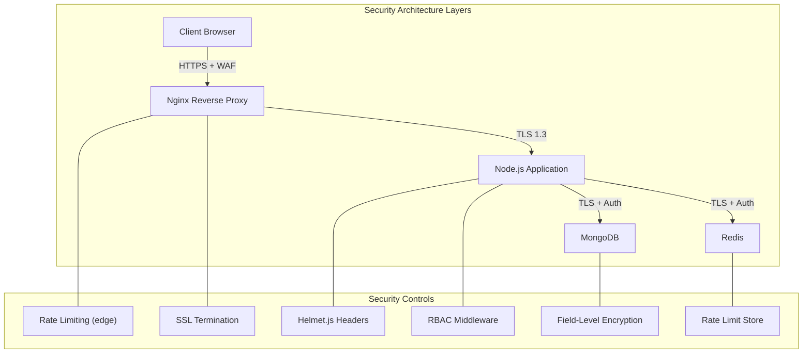
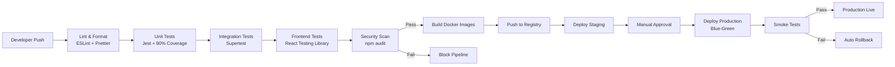

## 13. Security Implementation & Deployment

The SMS processes sensitive student records, financial data, and identity documents. This chapter covers defensive measures, compliance frameworks, and deployment automation for production.

### 13.1 Application Security

#### 13.1.1 OWASP Mitigation Checklist

Each OWASP risk category maps to a concrete control in the SMS codebase.

| OWASP Category | Threat to SMS | Mitigation Control | Implementation Layer |
|---|---|---|---|
| A01 — Broken Access Control | Students accessing other students' marks/fee records | RBAC middleware with role-permission matrix | Express middleware |
| A03 — Injection | NoSQL injection via unfiltered query parameters | `express-mongo-sanitize`, Mongoose parameterized queries | Request pipeline |
| A07 — Auth Failures | JWT theft, brute-force login | `httpOnly` refresh tokens, bcrypt (12 rounds), rate-limited auth | Auth service |
| A08 — Data Integrity | Malicious npm packages with backdoors | `npm audit` in CI, Dependabot alerts, lockfile integrity checks | CI/CD pipeline |
| A02 — Cryptographic Failures | Plaintext storage of Aadhaar/SSN | AES-256 field-level encryption, TLS 1.3 | Database + Network |
| A04 — Insecure Design | Direct file access to uploaded documents | Random filenames, controller-mediated download | File upload service |
| A05 — Security Misconfiguration | Default credentials, debug endpoints | Environment config, `NODE_ENV=production` | Configuration layer |
| A06 — Vulnerable Components | Outdated dependencies with CVEs | Dependabot PRs, `npm audit` blocks deploy | Dependency management |
| A09 — Logging Failures | Undetected breach or tampering | Structured JSON audit logs, correlation IDs | Logging service |
| A10 — SSRF | Server requests to internal services | Outbound URL whitelist, deny internal IPs | Network layer |

#### 13.1.2 Helmet.js Configuration

Helmet.js sets HTTP security headers to mitigate XSS, clickjacking, and protocol downgrade attacks.

```javascript
// server/middleware/security.js
import helmet from 'helmet';

const helmetConfig = helmet({
  contentSecurityPolicy: {
    directives: {
      defaultSrc: ["'self'"],
      scriptSrc: ["'self'", "'unsafe-inline'"],
      styleSrc: ["'self'", "'unsafe-inline'", 'https://fonts.googleapis.com'],
      fontSrc: ["'self'", 'https://fonts.gstatic.com'],
      imgSrc: ["'self'", 'data:', 'blob:'],
      connectSrc: ["'self'", process.env.API_BASE_URL],
      frameAncestors: ["'none'"],
      upgradeInsecureRequests: [],
    },
  },
  frameguard: { action: 'deny' },
  hsts: { maxAge: 31536000, includeSubDomains: true, preload: true },
  noSniff: true,
  referrerPolicy: { policy: 'strict-origin-when-cross-origin' },
  xssFilter: true,
  hidePoweredBy: true,
});

export default helmetConfig;
```

The `frameAncestors: "'none'"` directive prevents clickjacking; HSTS with `preload: true` enables browser hardcoded HTTPS lists.

#### 13.1.3 Rate Limiting

A two-tier strategy protects against brute-force attacks using Redis-backed counters.

```javascript
// server/middleware/rateLimiter.js
import rateLimit from 'express-rate-limit';
import RedisStore from 'rate-limit-redis';
import { createClient } from 'redis';

const redisClient = createClient({ url: process.env.REDIS_URL });
redisClient.connect().catch(console.error);

const INTERNAL_IPS = ['10.0.1.', '10.0.2.', '127.0.0.1'];
const isInternalIP = (ip) => INTERNAL_IPS.some((p) => ip.startsWith(p));

export const generalLimiter = rateLimit({
  store: new RedisStore({ sendCommand: (...a) => redisClient.sendCommand(a) }),
  windowMs: 15 * 60 * 1000, max: 100, standardHeaders: true, legacyHeaders: false,
  skip: (req) => isInternalIP(req.ip),
  message: { success: false, message: 'Too many requests.' },
});

export const authLimiter = rateLimit({
  store: new RedisStore({ sendCommand: (...a) => redisClient.sendCommand(a) }),
  windowMs: 15 * 60 * 1000, max: 10, standardHeaders: true, legacyHeaders: false,
  message: { success: false, message: 'Too many authentication attempts.' },
});
```

The `authLimiter` counts every request regardless of outcome, preventing username harvesting. Internal IPs are whitelisted.

#### 13.1.4 CORS Policy

Only origins in `ALLOWED_ORIGINS` may access the API, and credentials are permitted only for matching origins. Production uses exactly the frontend domain — no wildcard (`*`) allowances.

#### 13.1.5 File Upload Security

Uploads are validated through: (1) type whitelist (`jpg`, `jpeg`, `png`, `pdf`) enforced via `multer` by MIME-type magic number, (2) 5 MB size limit, (3) ClamAV virus scanning, (4) filename randomization with `crypto.randomBytes(16)`, (5) storage outside the web root served through authenticated endpoints.

### 13.2 Data Security & Compliance

#### 13.2.1 Encryption at Rest

Sensitive documents are encrypted with AES-256-GCM before persistence; the key resides in a cloud KMS. For Aadhaar/SSN fields, MongoDB Client-Side Field Level Encryption (CSFLE) encrypts data before it leaves the application.

#### 13.2.2 TLS/SSL

All communication uses TLS 1.3. HTTPS enforcement uses an Nginx `301` redirect, the HSTS header, and Let's Encrypt certificates with automatic Certbot renewal.

#### 13.2.3 Backup Strategy

Daily backups at 02:00 AM via `mongodump` produce gzipped archives with checksums, uploaded to S3 with server-side encryption. Retention: 7 days local, 30 days cloud, quarterly archives for 1 year. Restores are tested monthly.

#### 13.2.4 Data Privacy

GDPR-compliant consent tracking records purpose, timestamp, and withdrawal at each collection point. `/gdpr/export` produces a portable JSON dump; `/gdpr/erase` anonymizes records for statutory retention before deletion. For US institutions, FERPA restricts education record access. Analytics datasets undergo k-anonymity treatment.

### 13.3 Logging & Monitoring

#### 13.3.1 Application Logging

Winston with `winston-daily-rotate-file` creates daily logs, compressing files older than 7 days. Entries use structured JSON with correlation IDs. Levels: `error`, `warn`, `info`, `debug`.

#### 13.3.2 Audit Logging

Every mutation generates an immutable record in `audit_logs` capturing actor, action, target entity, timestamp, and differential snapshot. The collection is append-only.

#### 13.3.3 API Monitoring

Custom middleware records method, route, status, and duration per request. Slow query detection warns on requests exceeding 500 ms. Error rate alerting fires when a 5-minute window exceeds 1% errors.

#### 13.3.4 Health Checks

`GET /health` returns MongoDB and Redis connectivity, disk space, and memory status. `GET /ready` adds application readiness for Kubernetes probes. External monitoring verifies `/health` every 60 seconds.

### 13.4 Containerization & CI/CD

The following diagram illustrates the defense-in-depth security layers.



#### 13.4.1 Docker Configuration

The backend uses a multi-stage build for minimal attack surface, running as non-root.

```dockerfile
# server/Dockerfile
FROM node:20-alpine AS deps
WORKDIR /app
COPY package*.json ./
RUN npm ci --only=production && npm cache clean --force

FROM node:20-alpine AS production
RUN addgroup -g 1001 -S nodejs && adduser -S nodejs -u 1001
WORKDIR /app
COPY --from=deps --chown=nodejs:nodejs /app/node_modules ./node_modules
COPY --from=deps --chown=nodejs:nodejs /app/package.json ./
COPY --chown=nodejs:nodejs ./src ./src
COPY --chown=nodejs:nodejs ./server.js ./
USER nodejs
EXPOSE 3000
HEALTHCHECK --interval=30s --timeout=5s --retries=3 \
  CMD node -e "require('http').get('http://localhost:3000/health', (r) => process.exit(r.statusCode === 200 ? 0 : 1))"
CMD ["node", "server.js"]
```

The frontend Dockerfile uses `nginx:alpine` to serve static Vite output with gzip and SPA fallback.

#### 13.4.2 Docker Compose

The local stack defines `app` (Node.js), `web` (React/Vite), `mongodb`, and `redis` with volume mounts for hot-reload via `nodemon` and Vite HMR.

#### 13.4.3 CI/CD Pipeline

The GitHub Actions workflow implements continuous delivery with security gates.



The pipeline triggers on every push to `main`. Lint enforces `eslint-plugin-security` rules. `npm audit --audit-level=moderate` fails the build on moderate-or-higher CVEs. Production requires manual approval before blue-green deployment.

#### 13.4.4 Testing Stages

Unit tests (Jest) cover services with mocked databases. Integration tests (Supertest) exercise HTTP cycles against `mongodb-memory-server`. Frontend tests (React Testing Library) verify rendering. The security scan runs alongside `eslint-plugin-security`.

#### 13.4.5 Environment Management

Three environments isolate the lifecycle. **Development** runs via Docker Compose with seeded data. **Staging** deploys to a single cloud instance. **Production** runs multiple instances behind a load balancer. Configuration is injected at runtime via environment variables or a secrets manager.

### 13.5 Production Deployment

#### 13.5.1 Cloud Deployment

For a 10,000-student institution (~500 concurrent peak users), AWS ECS Fargate offers the best balance at ~$180–250/month for compute plus $50 for DocumentDB and $30 for S3. DigitalOcean Droplets cost ~$100–150/month with higher operational overhead. Heroku delivers simplicity at $250–400/month with less control. AWS ECS Fargate is recommended for its compliance certifications (SOC 2, ISO 27001).

#### 13.5.2 Nginx Reverse Proxy

Nginx handles SSL termination, gzip compression, edge rate limiting, static file delivery, and upstream load balancing with WebSocket upgrade support for Socket.io connections.

#### 13.5.3 Process Management

PM2 runs Node.js in cluster mode (`instances: 'max'`) with one worker per CPU core, handling auto-restart on crashes, log rotation, and memory-limit restarts. The `pm2 reload` command replaces workers one at a time for zero-downtime deployments.

#### 13.5.4 Post-Deployment

An automated smoke test executes within 60 seconds: verify `/health` returns `200`, confirm database connectivity, validate frontend loads, check authentication, and ensure WebSocket connections. On failure, the pipeline auto-rolls back to the previous Docker image. Database migrations run in a pre-start init container. CDN cache invalidation flushes static assets within 5 minutes.
n flushes static assets within 5 minutes.
